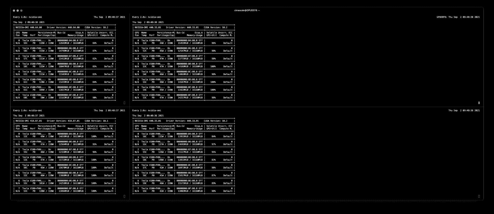
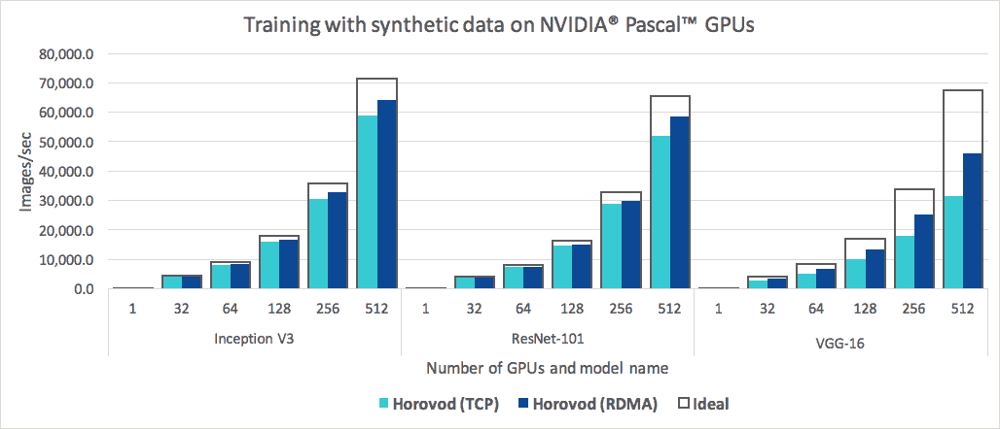

# 作为创业公司，如何训练大型深度学习模型

> 原文：<https://www.assemblyai.com/blog/how-to-train-large-deep-learning-models-as-a-startup/>

## 介绍

OpenAI 的 GPT-3 是一个令人印象深刻的深度学习模型，但在 175B 参数下，它是相当的资源猪！估计各不相同，但这种规模的模型将需要*数百年才能在单个 GPU 上训练*。

幸运的是，OpenAI 受益于微软提供的 NVIDIA V100 GPU 的高带宽集群，这使他们能够在几周内训练 GPT-3，而不是几年。这个星团到底有多大？根据本文中的[，在 1024 个 NVIDIA A100 GPUs 上训练 GPT-3 大约需要 34 天。](https://arxiv.org/pdf/2104.04473.pdf)

这是一个令人难以置信的 GPU 数量。每个 100 GPU 的价格为[$ 9900](http://www.acmemicro.com/Product/17742/NVIDIA-900-21001-0000-000-Ampere-A100-For-PCIe-40GB-HBM2-PCIe-4-0-GPU----Passive-Cooling)，我们谈论的是差不多**$ 1000 万**来建立一个那么大的集群。我们甚至没有考虑电力成本，或者实际安装 GPU 的服务器机架，或者维护这种硬件的人力成本，以及其他成本。

如今，你可以从像谷歌云这样的公共云提供商那里租用 100 个 GPU，但每小时 2.933908 美元(T1)，这仍然需要花费 2451526.58 美元(T3)来运行 1024 个 A100 GPU 34 天。记住，这个价格是单次训练的*！*

我可以继续，但重点是训练大模特*又贵又慢*。在 AssemblyAI 这里，我们不是在 175B 参数范围内训练模型(谢天谢地)，但我们的语音识别模型是非常大的变压器，正在快速接近 1B 参数大小。作为一家初创公司，速度和成本是我们必须不断优化的两件事。

创业都是为了快速迭代。大多数公司可以从客户那里得到反馈，并在一个周末发布一个新功能。但当你是一家深度学习公司，你的模型需要数周时间来训练时，你作为初创公司的迭代速度会受到显著阻碍。

解决这个问题的主要方法是在更多的 GPU 上训练你的模型，但这需要很高的成本，通常是初创公司负担不起的。在过去的几年里，我们学到了一些关于训练大型模型的经验，并希望与社区分享。

## 我们的模型尺寸和训练时间

在 AssemblyAI，我们构建大型、精确的自动语音识别(ASR)模型，并通过简单的[语音转文本 API](https://www.assemblyai.com/) 公开这些模型。开发人员使用我们的 API 来构建应用程序，以转录电话、缩放会议、播客、视频和其他类型的媒体内容。

[See Also: What is ASR?](https://www.assemblyai.com/blog/what-is-asr/)

我们性能最好的 ASR 模型是大型变压器，在 48x V100 GPUs 上训练大约需要 3 周时间。



32 NVIDIA V100s training a model

为什么我们的模型需要这么长的训练时间，需要这么多的 GPU？有三个主要的促成因素:

### 1.ASR 模型的输入特征是高维、长序列

我们或多或少每 10 毫秒计算一次音频文件的声谱图，并将这些值作为神经网络的输入特征。声谱图的形状/尺寸因音频数据的采样率而异，但如果采样率为 8000 Hz，声谱图中的特征数将为 81。对于一个 16 秒的音频样本，形状将是`[1600, 81]` -这是一个相当大的特征输入！

下面是光谱图作为矩阵的一个例子:

```
[[[-5.7940, -5.7940, -4.1437,  ...,  0.0000,  0.0000,  0.0000],
          [-5.9598, -5.9598, -4.2630,  ...,  0.0000,  0.0000,  0.0000],
          [-5.9575, -5.9575, -4.2736,  ...,  0.0000,  0.0000,  0.0000],
          ...,
          [-4.6040, -4.6040, -3.5919,  ...,  0.0000,  0.0000,  0.0000],
          [-4.4804, -4.4804, -3.5587,  ...,  0.0000,  0.0000,  0.0000],
          [-4.4797, -4.4797, -3.6041,  ...,  0.0000,  0.0000,  0.0000]]],

        [[[-5.7940, -5.7940, -5.7940,  ...,  0.0000,  0.0000,  0.0000],
          [-5.9598, -5.9598, -5.9598,  ...,  0.0000,  0.0000,  0.0000],
          [-5.9575, -5.9575, -5.9575,  ...,  0.0000,  0.0000,  0.0000],
          ...,
          [-4.6040, -4.6040, -4.6040,  ...,  0.0000,  0.0000,  0.0000],
          [-4.4804, -4.4804, -4.4804,  ...,  0.0000,  0.0000,  0.0000],
          [-4.4797, -4.4797, -4.4797,  ...,  0.0000,  0.0000,  0.0000]]],

        [[[-5.7940, -5.7940, -5.7940,  ...,  0.0000,  0.0000,  0.0000],
          [-5.9598, -5.9598, -5.9598,  ...,  0.0000,  0.0000,  0.0000],
          [-5.9575, -5.9575, -5.9575,  ...,  0.0000,  0.0000,  0.0000],
          ...,
          [-4.6040, -4.6040, -4.6040,  ...,  0.0000,  0.0000,  0.0000],
          [-4.4804, -4.4804, -4.4804,  ...,  0.0000,  0.0000,  0.0000],
          [-4.4797, -4.4797, -4.4797,  ...,  0.0000,  0.0000,  0.0000]]] 
```

### 2.我们的模型有大量的参数

当谈到基于变压器的神经网络时，通常越大越好。有许多论文支持这种说法，GPT-3 是最受欢迎的例子。在研究团体和我们自己的内部研究中，我们发现这种趋势对于 ASR 模型也是如此。

我们性能最好的型号是拥有近 5 亿个参数的大型变压器。参数越多，在反向传播期间更新梯度所需的计算能力就越大。训练一个神经网络基本上可以归结为做一堆矩阵运算。模型中的参数越多，矩阵就越大。大型矩阵需要更多的计算和 GPU 内存资源。


Neural Networks require lots of Matrix Multiplication. Source: [https://www.jeremyjordan.me/intro-to-neural-networks/](https://www.jeremyjordan.me/intro-to-neural-networks/)

### 3.我们根据大量数据进行训练

大型模型具有更强的建模能力——这要归功于它们参数大小的增加——为了利用这种建模能力，我们在近 100，000 小时的标记语音数据上训练我们的模型。例如，GPT-3 是在 45TB 的文本数据上训练的，这也可以被认为是大约 1099511626800 个单词的文本。

在训练神经网络时，需要对数据集进行多次迭代(每次迭代称为一个“时期”)。数据集越大，每次迭代或“时期”花费的时间就越长。即使[提前停止](https://en.wikipedia.org/wiki/Early_stopping)，在大数据集上训练 20-50 个时期的大模型也会花费很多时间！

## 如何提高迭代速度

创业公司有一项艰巨的任务——在短时间内取得很大进展。那些在最短时间内取得最大进展的公司，通常被称为“突破型”创业公司。

作为一家深度学习初创公司，这提出了一个艰难的挑战。当你的模型需要 3-4 周训练时，你如何快速迭代？

### 在更多 GPU 上训练

减少训练时间最简单的方法就是在更多的 GPU 上训练你的模型。更多的 GPU 意味着更多的 GPU 内存可用于您的训练。例如，假设您可以在单个 GPU 上安装一个大小为 8 的小批量。如果您的数据集中有 1，000 个样本要迭代，这意味着要迭代 125 个小批量(每个大小为 8)。如果每次迭代需要 1 秒，那么迭代所有 125 个小批量将需要 125 秒。

如果你有 4 个 GPU，你可以一次并行迭代 4 个小批量，而不是 1 个小批量。这意味着只需要 32 次迭代就可以完成所有 125 个小批量。假设现在 4 个 GPU 的每次迭代需要 1.5 秒，因为 4 个 GPU 的额外通信开销，但您仍然可以在 48 秒内迭代整个数据集(32 * 1.5)。这几乎比单个 GPU 快 3 倍！

然而，需要注意的一点是，更大的批量并不总是等同于更快的训练时间。如果您的有效批量变得太大，它会开始损害您的模型的整体收敛性。选择正确的批量大小进行训练是一个你必须试验的超参数，并且正在对不同的优化器进行研究，如 [LAMB 和 LARS](https://arxiv.org/pdf/1904.00962.pdf) 有助于缓解大批量大小损害收敛的问题。

### GPU 性能不是线性扩展的

训练的 GPU 越多，通信开销就越大。例如，这就是为什么在 8 个 GPU 上进行训练并不比在单个 GPU 上进行训练快 8 倍。在 AssemblyAI，我们使用 [Horovod](https://github.com/horovod/horovod) 来管理我们跨许多 GPU 的分布式训练运行。Horovod 是一个很棒的库，当你向训练集群添加更多的 GPU 时，它可以帮助你获得更高的效率。



Training times with Horovod

在我们的测试中，我们发现 Horovod 比分布式 TensorFlow 和 PyTorch 分布式 DataParallel 快得多。也就是说，PyTorch 正在积极开发和快速改进中。在我们的测试中，我们发现 PyTorch DistributedDataParallel 在单个服务器上与 Horovod 不相上下——但是 Horovod 在将训练运行扩展到多个服务器时表现更好(例如，4 个服务器，每个服务器有 8 个 GPU)。

### 低精度训练

默认情况下，大多数模型都使用 FP32 进行训练(浮点值 32，也称为单精度)。用半精度(FP16)或混合精度训练，也可以加快你的训练时间。

FP16 张量是 16 位，或 2 字节，其中每一位是 0 或 1，如`01010101 10101010`。一个 FP32 张量是 32 位，或者 4 字节，比如`11110000 00001111 11001100 00110011`。

训练期间的精度越低，意味着字节数越少，这意味着训练期间需要的 GPU 内存越少，需要的带宽越少，新 GPU 上的实际硬件级操作往往运行得更快——所有这些都加快了训练时间。

使用 PyTorch 下降到 FP16 相对容易，例如`x = x.half`将 FP32 张量向下投射到 FP16。然而，要记住的是，在实践中低精度的训练并不总是在公园里散步。一些操作或自定义损失函数可能不支持较低的精度，可能需要大量的超参数调整才能使您的模型与 FP16 收敛，较低的精度也可能会损害您的模型的整体精度。

## 如何降低培训成本

这很简单- **不要使用像 AWS 或 Google Cloud** 这样的公共云。这似乎是最简单的开始方式，但是成本会很快增加，尤其是与下面的选项相比。

### 购买自己的硬件

如果你喜欢管理自己的硬件(我们不建议这样做)，购买消费级 GPU，如 [NVIDIA TITAN X](https://www.nvidia.com/en-us/geforce/products/10series/titan-x-pascal/) ，是一个相对便宜的选择。例如，每台 TITAN X 的价格大约为[、3000 美元](https://www.newegg.com/p/1FT-0004-00262)，作为一张消费级 GPU 卡，它的性能出奇的好。如果你有能力建造自己的训练平台，这条路线会带来一次性的硬件费用，但也会带来托管和维护训练平台的麻烦。

像 https://lambdalabs.com/这样的公司提供可定制的、相对便宜的训练装备，可以运送给你。例如，一台配有 4 块英伟达 RTX A5000 卡和 NVLink 的电脑售价约为 16500 美元。这包括内存、处理器、外壳等。你要做的就是找个地方插上这个，然后付电费。

### 专用云服务器

在 AssemblyAI，我们从 Cirrascale 租赁专用服务器。有许多像 Cirrascale 这样的提供商，但是为专用服务器付费比像 AWS 或 Google Cloud 这样的大型公共云给*提供了更好的价格。该选项还使您能够根据您需要的 RAM 和处理器规格定制您的机器，并在您可以选择的 GPU 卡方面提供更多灵活性。*

例如，AWS 仅提供以下 GPU:

*   NVIDIA Tesla M60 GPUs
*   英伟达 A100
*   英伟达特斯拉 V100
*   NVIDIA K80(这些太恐怖了)

而 Cirrascale 则提供了各种各样的 GPU，如 P100s、V100s、A100s、RTX 8000 等。

通常，你不需要最昂贵的 GPU 卡(今天的 A100s)来在合理的时间内训练你的模型。另外，最新和最棒的 GPU 通常不会立即得到 PyTorch 和 TensorFlow 等流行框架的支持。例如，NVIDIA A100s 在 PyTorch 支持之前花了一点时间。

与 AWS 或 Google Cloud 等大型公共云相比，能够定制一台机器来满足您的培训需求和预算是与较小的托管提供商合作的巨大优势。你也不必担心语音转文本的隐私问题，就像你有时对这些大提供商所做的那样。此外，因为您租用的是整个物理机，而不是像通过 AWS/GCP 获得的虚拟机，所以实际机器的整体性能要好得多。

## 包扎

总之，作为一家初创公司，训练大型深度学习模型是一个其他许多初创公司都不会面临的挑战。成本可能很高，迭代时间可能很慢，如果你不小心，这些因素可能会严重阻碍你的创业进展。

如果你正在考虑创办一家深度学习公司——我们强烈推荐申请 [Y Combinator 的人工智能赛道](https://www.ycombinator.com/ai)。AssemblyAI 是 2017 年这条赛道的一部分，它拥有 AWS 和 GCP 等大型公共云的大量 GPU 积分，以及 Cirrascale 等提供商的折扣。

丹尼尔·格罗斯的[先锋计划](https://pioneer.app/offer)还提供高达 10 万美元的 AWS 积分，你可以在离开地面时花在训练跑步上。

如果你想阅读更多这样的帖子，你可以在 Twitter [@assemblyai](https://twitter.com/AssemblyAI) 和 [@youvegotfox](https://twitter.com/YouveGotFox) 上关注我们。

寻找更多这样的帖子？

订阅我们的时事通讯！

[Subscribe Now](Subscribe to our newsletter!)