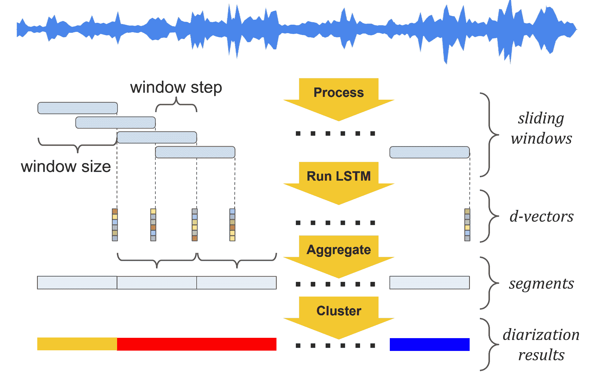
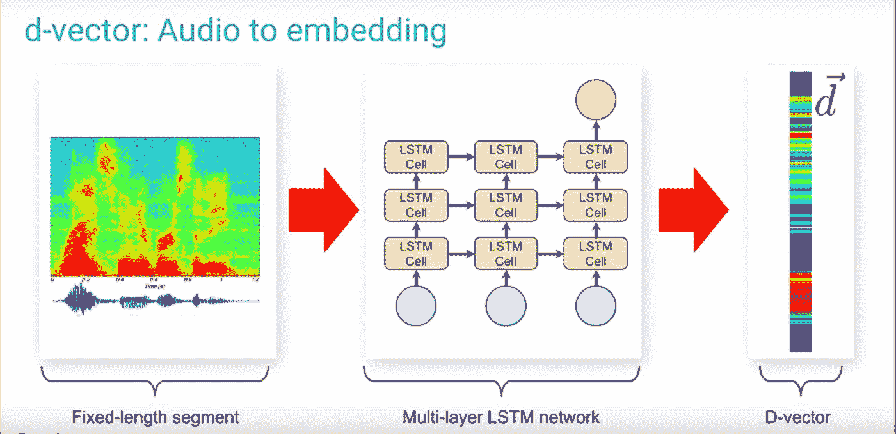

# 扬声器二进制化-单声道文件的扬声器标签

> 原文：<https://www.assemblyai.com/blog/speaker-diarization-speaker-labels-for-mono-channel-files/>

说话者二进制化(又名*说话者二进制化*)是根据说话者的身份自动分割音频或视频输入的过程。它可以帮助你回答“谁在什么时候发言？”。


随着最近几年深度学习的应用和进步，自动(自信地)验证和识别说话者的能力现在是可能的。

媒体监控、电话、播客、远程医疗和网络会议等行业几乎总是使用多扬声器的音频和视频。这些同样受到自动化转录进展严重影响的行业，依靠说话者二进制化来完全取代他们工作流程中的人工转录。

扬声器二进制化与最先进的精确度相结合，有可能为任何单声道录音带来巨大的价值。如果你现在有兴趣测试这个，可以查看我们关于[扬声器二进制化](https://docs.assemblyai.com/guides/getting-speaker-labels-speaker-diarization?undefined)的 API 文档。

关于语音到文本如何工作的更多信息，您可以在这里了解如何在 PyTorch 中构建一个[端到端模型。](https://www.assemblyai.com/blog/end-to-end-speech-recognition-pytorch/)

## 扬声器二进制化如何工作

过去，[基于 I 向量的音频嵌入技术](http://danielpovey.com/files/2017_interspeech_embeddings.pdf?undefined)用于说话人验证和二进制化。然而，随着最近深度学习的突破，基于神经网络的音频嵌入(也称为 d-vectors)已被证明是最好的方法。

更具体地说，具有非参数聚类的基于 LSTM 的 d 向量音频嵌入有助于实现最先进的说话人二进制化系统。


## 说话人分化的基础设施



**步骤 1 - **语音检测**–**使用语音活动检测器(VAD)识别语音并去除噪声。


**步骤 2 -语音分段—**从音频中提取小段(滑动窗口)&运行 LSTM 网络，为每个滑动窗口生成 D 矢量。



**步骤 **3** - **嵌入提取**-**聚集属于该片段的每个片段的 d 向量，以产生逐片段嵌入。

**步骤 **4** - **聚类**-**-对分段嵌入进行聚类，产生二值化结果。使用我们集成到我们的二进制化系统中的两个聚类算法，用每个发言者的时间戳来确定发言者的数量。

*   ****离线聚类-**** 所有片段嵌入可用后产生说话人标签 *****‍*****
*   ****K 均值聚类:**** 使用[k 均值++](http://ilpubs.stanford.edu:8090/778/1/2006-13.pdf?undefined) 进行初始化以确定说话人 ek 的数量，我们使用“肘”的导数的条件均方余弦距离(MSCD)在每个嵌入到其聚类质心之间 *****‍*****
*   *****谱聚类:******1)构造亲和矩阵，2)执行细化操作 3)对细化的亲和矩阵执行特征分解 4)使用 K-Means 对这些新嵌入进行聚类，并产生说话者标签*

**

## *活跃的研究领域*

*基于神经网络的聚类技术——例如，[UIS·RNN](https://github.com/google/uis-rnn/?undefined)*

*   *更好地处理多个扬声器同时讲话时的串扰-例如，[源分离](https://arxiv.org/pdf/1708.07524.pdf?undefined)*
*   *提高了在有许多扬声器时检测音频/视频文件中扬声器数量的能力*
*   *改进了在背景噪音、音乐或其他频道干扰严重时对嘈杂音频文件的处理*

## *如何使用 AssemblyAI 启用扬声器二进制化*

*AssemblyAI 可以自动检测音频文件中的扬声器数量，转录文本中的每个单词都可以与其扬声器相关联。*

*以下代码示例展示了如何在 Python 中打开扬声器标签的情况下提交音频或视频文件进行转录。你可以在我们的 API 文档[中查看更多编程语言的代码样本。](https://docs.assemblyai.com/guides/getting-speaker-labels-speaker-diarization?undefined)*

```
*`import requests

endpoint = "https://api.assemblyai.com/v2/transcript"

json = {
  "audio_url": "https://app.assemblyai.com/static/media/phone_demo_clip_1.wav",
  "speaker_labels": True
}

headers = {
    "authorization": "YOUR-API-TOKEN",
    "content-type": "application/json"
}

response = requests.post(endpoint, json=json, headers=headers)

print(response.json())`*
```

*提交文件进行处理后，可以通过发出 get 请求来获得转录结果。*

```
*`import requests

endpoint = "https://api.assemblyai.com/v2/transcript/YOUR-TRANSCRIPT-ID-HERE"

headers = {
    "authorization": "YOUR-API-TOKEN",
}

response = requests.get(endpoint, headers=headers)

print(response.json())`*
```

*您将得到如下所示的 JSON 响应。“话语”键将包含一个“逐个回合”的话语列表，就像它们出现在音频记录中一样。*

*一个“ ****转**** ”就是一个“ ****转**** ”在扬声器通话期间。例如，说话者 A 说“你好”(话轮 1)，然后说话者 B 说“你好”(话轮 2)。*

```
*`{
    "id": "5552830-d8b1-4e60-a2b4-bdfefb3130b3",
    "status": "completed",
    "text": "Hi, I'm joy. Hi, I'm sharon. Do you have kids in school. ...",
    # the "utterances" key below is a list of the turn-by-turn utterances found in the audio
    "utterances": [
        {
            # speakers will be marked as "A" through "Z"
            "speaker": "A",
            "confidence": 0.97,
            "end": 1380,
            "start": 0,
            # the text for the entire speaker "turn"
            "text": "Hi, I'm joy.",
            # the individual words from the speaker "turn"
            "words": [
                {
                    "speaker": "A",
                    "confidence": 1.0,
                    "end": 320,
                    "start": 0,
                    "text": "Hi,"
                },
                ...
            ]
        },
        # the next "turn" by speaker "B" - for example
        {
            "speaker": "B",
            "confidence": 0.94,
            "end": 3260,
            "start": 0,
            "text": "Hi, I'm sharon.",
            "words": [
                {
                    "speaker": "B",
                    "confidence": 1.0,
                    "end": 480,
                    "start": 0,
                    "text": "Hi,"
                },
                ...
            ]
        },
        {
            "speaker": "A",
            "confidence": 0.94,
            "end": 5420,
            "start": 2820,
            "text": "Do you have kids in school.",
            "words": [
                {
                    "speaker": "A",
                    "confidence": 1.0,
                    "end": 4300,
                    "start": 2820,
                    "text": "Do"
                },
                ...
            ]
        },
    ],
    # all of the words found in the audio across all speakers
    "words": [
        {
            "speaker": "A",
            "confidence": 1.0,
            "end": 320,
            "start": 0,
            "text": "Hi,"
        },
        {
            "speaker": "A",
            "confidence": 1.0,
            "end": 720,
            "start": 320,
            "text": "do"
        },
        ...
    ]
}`*
```

## *扬声器二进制用例*

### *远距离医学*

*自动标记预约记录上的<patient>和<doctor>，使其更具可读性和实用性。通过更好的标记/索引以及触发随访和处方补充等操作的能力，简化了向医疗保健 ERP 或数据库的导入。</doctor></patient>*

### *电话会议*

*自动标记电话会议录音中的多个发言人，使转录更加有用。这使得销售和支持辅导平台能够分析和显示由界面中的<agent>和<customer>分割的文本，从而使搜索和导航更加简单。这也有助于触发跟进、票证状态更改等操作。</customer></agent>*

### *播客托管*

*在录音上自动标记播客<host>和<guest>，无需听音频或视频，即可生动呈现文稿。这对于播客来说尤其重要，因为大多数文件都是在单声道上录制的，并且几乎总是包含多个扬声器。播客托管平台可以使用脚本来推动更好的 SEO，改善搜索/导航，并提供播客用户可能无法获得的见解。</guest></host>*

### *招聘平台*

*在招聘面试录音上自动标注<recruiter>和<applicant>。申请人跟踪系统的客户严重依赖电话和视频电话来招募他们的申请人。扬声器二分法允许这些平台在不听音频或视频的情况下，将申请人的回答和招聘人员的提问分开。这也有助于触发一些行动，比如对申请人进行跟进，让他们进入招聘流程的下一阶段。</applicant></recruiter>*

### *视频托管*

*自动标记视频记录上的多个<speakers>,使自动字幕更加有用。视频托管平台现在可以更好地索引文件以进行更好的搜索，为观众提供更好的可访问性和导航，并为 SEO 创建更多有用的内容。</speakers>*

### *广播媒体*

*自动标记广播电台或电视录像上的多个<guests>和<hosts>，以便围绕关键词进行更精确的搜索和分析。媒体监测平台现在可以通过标记哪个发言者提到了他们的关键词(例如可口可乐)来为他们的客户提供更多见解。这也允许它们为单个记录回放提供更好的索引、搜索和导航。</hosts></guests>*

### *来源*

*   *[https://arxiv.org/pdf/1710.10468.pdf](https://arxiv.org/pdf/1710.10468.pdf?undefined)*
*   *[https://arxiv.org/pdf/2002.08933.pdf](https://arxiv.org/pdf/2002.08933.pdf?undefined)*
*   *[https://arxiv.org/pdf/1810.04719.pdf](https://arxiv.org/pdf/1810.04719.pdf?undefined)*
*   *[http://ilpubs.stanford.edu:8090/778/1/2006-13.pdf](http://ilpubs.stanford.edu:8090/778/1/2006-13.pdf?undefined)*
*   *[https://towards data science . com/speaker-dia lization-with-kaldi-e 30301 b 05 cc 8](https://towardsdatascience.com/speaker-diarization-with-kaldi-e30301b05cc8?undefined)*
*   *[https://oxfordwaveresearch.com/products/cleaver/](https://oxfordwaveresearch.com/products/cleaver/?undefined)*
*   *[http://danielpovey . com/files/2017 _ interspeech _ embeddings . pdf](http://danielpovey.com/files/2017_interspeech_embeddings.pdf?undefined)*
*   *[https://medium . com/datadriveninvestor/speaker-diarization-22121 f 1264 B1](https://medium.com/datadriveninvestor/speaker-diarization-22121f1264b1?undefined)*
*   *[https://slacker . ro/2019/08/16/joint-speech-recognition-and-speaker-diarization-via-sequence-transduction/](https://slacker.ro/2019/08/16/joint-speech-recognition-and-speaker-diarization-via-sequence-transduction/?undefined)*

*在这里继续学习[扬声器二进制化](https://www.assemblyai.com/blog/what-is-speaker-diarization-and-how-does-it-work/)！*