# 如何在局部运行稳定扩散来生成图像

> 原文：<https://www.assemblyai.com/blog/how-to-run-stable-diffusion-locally-to-generate-images/>

紧随 [DALL-E 2](https://www.assemblyai.com/blog/how-dall-e-2-actually-works/) 和 [Imagen](https://www.assemblyai.com/blog/how-imagen-actually-works/) 的脚步，新的深度学习模型 **[稳定扩散](https://github.com/CompVis/stable-diffusion)** 标志着文本到图像领域的一次量子飞跃。本月早些时候发布的稳定扩散承诺通过足够高效地在消费级 GPU 上运行来民主化文本条件图像生成。就在本周一，稳定的扩散检查点首次发布，这意味着，*现在*，你只需几句话和几分钟时间就可以生成如下图像。

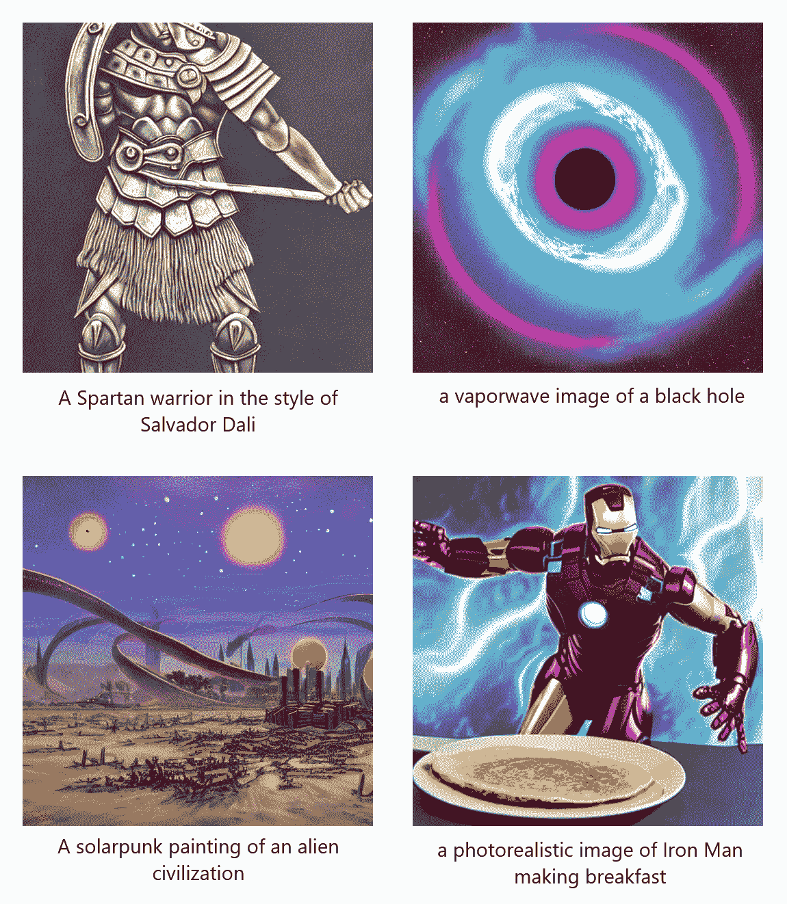

**本文将向您展示如何在 [GPU](#how-to-install-stable-diffusion-gpu) 和 [CPU](#how-to-install-stable-diffusion-cpu) 上安装和运行稳定扩散**，这样您就可以开始生成自己的图像了。让我们开始吧！

## 在 Colab 中使用稳定扩散

在我们了解如何在本地安装和运行稳定扩散之前，您可以查看下面的 Colab 笔记本，以了解如何在非本地使用稳定扩散。**请注意，您将需要 Colab Pro 来生成新图像**，因为 Colab 的免费版本用于采样的 VRAM 略少。

[Stable Diffusion in Colab (GPU)](https://colab.research.google.com/drive/1uWCe41_BSRip4y4nlcB8ESQgKtr5BfrN?usp=sharing)

**如果您没有 Colab Pro，也可以在 Colab 中的 CPU 上运行稳定扩散**，但请注意，图像生成将需要相对较长的时间(8-12 分钟):

[Stable Diffusion in Colab (CPU)](https://colab.research.google.com/drive/1NA8XytvxOT841JtaTao896Gm_SFT66N4?usp=sharing)

你也可以在 YouTube 上查看我们的[稳定扩散教程](https://www.youtube.com/watch?v=CtlxYoya2Sc)，了解如何使用 GPU 笔记本。

## 如何安装稳定扩散(GPU)

你将需要一个基于 UNIX 的操作系统来跟随本教程，所以如果你有一台 Windows 机器，考虑使用一个[虚拟机](https://www.vmware.com/)或 [WSL2](https://ubuntu.com/tutorials/install-ubuntu-on-wsl2-on-windows-10#1-overview) 。

### 步骤 1:安装 Python

首先，通过在终端中键入`python --version`来检查 Python 是否安装在您的系统上。如果返回的是 Python 版本，则继续进行[下一步](#step-2-install-miniconda)。否则，使用安装 Python

```py
sudo apt-get update
yes | sudo apt-get install python3.8
```

### 步骤 2:安装 Miniconda

接下来，我们需要确保安装了包/环境管理器 [conda](https://docs.conda.io/en/latest/) 。在终端输入`conda --version`。如果返回的是 conda 版本，则进入[下一步](#step-3-clone-the-stable-diffusion-repository)。

否则，请访问 [conda 网站](https://docs.conda.io/en/latest/miniconda.html)，下载并运行适用于您的 Python 版本和操作系统的 Miniconda 安装程序。对于 Python3.8，您可以使用以下命令下载并运行安装程序:

```py
wget https://repo.anaconda.com/miniconda/Miniconda3-py38_4.12.0-Linux-x86_64.sh
bash Miniconda3-py38_4.12.0-Linux-x86_64.sh
```

按住*键输入*以获得许可，然后在出现提示时键入“yes”继续。接下来，按*回车*确认安装位置，然后在询问安装程序是否应该初始化 Miniconda 时键入“yes”。最后，关闭终端，然后打开一个新的你想安装稳定扩散。

### 步骤 3:克隆稳定的扩散库

现在我们需要克隆稳定的扩散库。在终端中，执行以下命令:

```py
git clone https://github.com/CompVis/stable-diffusion.git
cd stable-diffusion/
```

如果你没有 git，你需要用`sudo apt install git`来安装它。在克隆存储库之前，请务必阅读并接受[稳定扩散许可证](https://github.com/CompVis/stable-diffusion/blob/main/LICENSE)。

### 步骤 4:创建 Conda 环境

接下来，我们需要创建一个 conda 环境，容纳我们运行稳定扩散所需的所有包。执行以下命令创建并激活这个名为`ldm`的环境

```py
conda env create -f environment.yaml
conda activate ldm
```

### 步骤 5:下载稳定的扩散权重

既然我们已经在合适的环境中使用稳定扩散，我们需要下载运行它所需的权重。如果您尚未阅读并接受[稳定扩散许可](https://github.com/CompVis/stable-diffusion/blob/main/LICENSE)，请务必现在就阅读并接受。已经发布了几个稳定的扩散检查点版本。较高的版本号已经过更多数据的训练，通常比较低的版本号表现更好。我们将使用**检查站 1.4 版**。使用以下命令下载权重:

```py
curl https://f004.backblazeb2.com/file/aai-blog-files/sd-v1-4.ckpt > sd-v1-4.ckpt
```

这就是我们开始使用稳定扩散所需的所有设置！请继续阅读，了解如何使用模型生成图像。

## 如何生成稳定扩散的图像(GPU)

要生成具有稳定扩散的图像，请打开终端并导航至`stable-diffusion`目录。通过执行命令`conda activate ldm`确保您处于正确的环境中。

要生成图像，请运行以下命令:

```py
python scripts/txt2img.py --prompt "YOUR-PROMPT-HERE" --plms --ckpt sd-v1-4.ckpt --skip_grid --n_samples 1 
```

解决纷争

*   如果您收到一个`ImportError`，您可能需要运行`sudo apt-get install libsm6 libxrender1 libfontconfig1`
*   如果执行突然停止，并且`killed`被打印到终端，您可能会遇到内存不足的错误。运行`cat /var/log/kern.log`查看有用的日志。
*   如果你遇到一个`RuntimeError: CUDA out of memory`错误，试着缩小图像的尺寸(并确保你只用`--n_samples 1`对一幅图像进行采样)。最小图像尺寸为 256x256。

在这里，用要生成图像的标题替换`YOUR-PROMPT-HERE`(留下引号)。使用提示 ***“一只蜥蜴骑着滑雪板穿越太空的真实感蒸汽波图像”*** 运行该命令，输出以下图像:


上面的图像是在 GCP 使用 Ubuntu 18.04 VM 和 NVIDIA Tesla K80 在大约一分钟内生成的。

### 脚本选项

您可以使用几个命令行参数定制该脚本，以根据您的需要定制结果。让我们来看看一些可能会派上用场的方法:

1.  `--prompt`后面加上引号的句子将指定**提示**为其生成图像。默认为“*一幅病毒怪物弹吉他的画*”。
2.  `--from-file`指定提示的**文件的文件路径，用于生成图像。**
3.  `--ckpt`后跟一个路径，指定使用模型的哪个**检查点**。默认为`models/ldm/stable-diffusion-v1/model.ckpt`。
4.  `--outdir`后面跟一个路径将指定**输出目录**来保存生成的图像。默认为`outputs/txt2img-samples`。
5.  `--skip_grid`将跳过创建组合图像。
6.  `--ddim_steps`后面跟一个整数指定了[扩散过程](https://www.assemblyai.com/blog/diffusion-models-for-machine-learning-introduction/#diffusion-modelsintroduction)中的**采样步数**。增加该数值会增加计算时间，但可能会改善结果。默认值为 50。
7.  `--n_samples`后跟一个整数，指定**对于每个给定的提示(批量)要生产多少样品**。默认值为 3。
8.  `--n_iter`后跟一个整数指定**运行采样循环**的次数。实际上与`--n_samples`相同，但如果遇到 OOM 错误，则使用此选项。参见[源代码](https://github.com/CompVis/stable-diffusion/blob/69ae4b35e0a0f6ee1af8bb9a5d0016ccb27e36dc/scripts/txt2img.py#L286)进行澄清。默认值为 2。
9.  `--H`后跟一个整数指定生成的图像的**高度**(以像素为单位)。默认值为 512。
10.  `--W`后跟一个整数指定生成图像的**宽度**(以像素为单位)。默认值为 512。
11.  `--scale`后跟一个浮点指定了 [**指导比例**](https://www.assemblyai.com/blog/how-imagen-actually-works/#classifier-free-guidance) 使用。默认值为 7.5
12.  `--seed`后跟一个整数，允许设置**随机种子**(用于可重复的结果)。默认值为 42。

您可以在`[txt2img.py](https://github.com/CompVis/stable-diffusion/blob/7b8c883b078024f68b56e862f247a64f9e282aac/scripts/txt2img.py#L45)`文件中看到带有默认值的可能参数的完整列表。现在让我们看一个使用这些可选参数的更复杂的生成提示。

在`stable-diffusion`目录中，创建一个名为`prompts.txt`的文件。创建几个提示，文件的每一行一个。例如:


现在，在终端的`stable-diffusion`目录下，运行

```py
python scripts/txt2img.py \
--from-file prompts.txt \
--ckpt sd-v1-4.ckpt \
--outdir generated-images \
--skip_grid \
--ddim_steps 100 \
--n_iter 3 \
--H 256 \
--W 512 \
--n_samples 3 \
--scale 8.0 \
--seed 119
```

下面可以看到每个标题的两个结果图像。上面的命令旨在作为使用更多命令行参数的示例，而不是作为最佳参数的示例。一般来说，根据经验，较大的图像质量较高，图像/字幕相似性较大，较低的引导比例可能会产生更好的结果。继续阅读[下一节](#tips-and-tricks)，了解更多关于改善稳定扩散结果的信息。

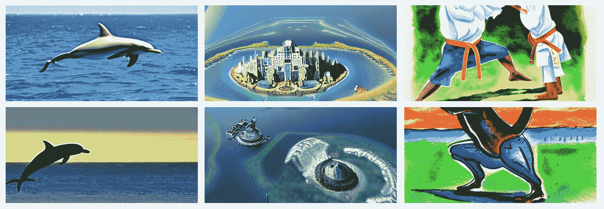

## 如何安装稳定扩散(CPU)

### 步骤 1:安装 Python

首先，通过在终端中键入`python --version`来检查 Python 是否安装在您的系统上。如果返回 Python 版本，继续下一步。否则，使用安装 Python

```py
sudo apt-get update
yes | sudo apt-get install python3.8
```

### 步骤 2:下载存储库

现在我们需要克隆稳定的扩散库。我们将使用[一个能够适应 CPU 推理的分支](https://github.com/bes-dev/stable_diffusion.openvino)。在终端中，执行以下命令:

```py
git clone https://github.com/bes-dev/stable_diffusion.openvino.git
cd stable_diffusion.openvino
```

如果你没有 git，你需要用`sudo apt install git`来安装它。在克隆存储库之前，请务必阅读并接受[稳定扩散许可证](https://github.com/CompVis/stable-diffusion/blob/main/LICENSE)。

### 步骤 3:安装需求

安装所有必要的要求

```py
pip install -r requirements.txt 
```

请注意，Scipy 1 . 9 . 0 版是一个列出的需求，但是它与 python 的旧版本不兼容。在运行上述命令之前，您可能需要通过编辑`requirements.txt`来更改 Scipy 版本，例如，改为`scipy==1.7.3`。

### 步骤 4:下载稳定的扩散权重

既然我们已经在合适的环境中使用稳定扩散，我们需要下载运行它所需的权重。如果您尚未阅读并接受[稳定扩散许可](https://github.com/CompVis/stable-diffusion/blob/main/LICENSE)，请务必现在就阅读并接受。已经发布了几个稳定的扩散检查点版本。较高的版本号已经过更多数据的训练，通常比较低的版本号表现更好。我们将使用**检查站 1.4 版**。使用以下命令下载权重:

```py
curl https://f004.backblazeb2.com/file/aai-blog-files/sd-v1-4.ckpt > sd-v1-4.ckpt
```

这就是我们开始使用稳定扩散所需的所有设置！请继续阅读，了解如何使用模型生成图像。

## 如何生成具有稳定扩散的图像(CPU)

现在一切都安装好了，我们准备生成稳定扩散的图像。**要生成图像，只需运行下面的命令**，将提示符更改为您想要的任何值。

```py
python demo.py --prompt "bright beautiful solarpunk landscape, photorealism"
```

推断时间将在大约 **8-12 分钟**时很长，所以在稳定扩散运行时，请随意喝杯咖啡。下面我们可以看到运行上述命令的输出:


## 提示和技巧

当您开始使用稳定扩散时，请在探索过程中记住这些提示和技巧。

### 快速工程

来自文本到图像模型的结果可能对用于描述期望场景的措辞敏感。**提示工程**是定制提示以获得期望结果的实践。例如，如果生成了低质量的图像，请尝试在标题前加上“的图像”。你也可以指定不同的风格和媒介，以达到不同的效果。查看以下每个下拉列表中的想法:

图像类型

尝试在标题前添加以下内容之一，以获得不同的效果:

*   “的形象”
*   "的照片"
*   "的头像"
*   "一幅画"
*   “一个愿景”
*   “对……的描述”
*   《一幅漫画》
*   "一幅画"
*   "一个数字"
*   "的插图"
*   "的草图"
*   “的写照”

风格

您可以指定不同的样式来实现不同的结果。尝试在提示中添加一个或多个下面的形容词，观察效果。

*   "现代主义者(ic)"
*   “抽象”
*   "印象派(ic)"
*   "表现主义(ic)"
*   "超现实主义者(ic)"

美学

您也可以尝试指定不同的美学。尝试在提示中添加一个或多个下面的形容词，观察效果。

*   “蒸汽波”
*   “合成波”
*   “赛博朋克”
*   “太阳能电池板”
*   “蒸汽朋克”
*   “山寨核心”
*   “天使核心”
*   “外星人”

艺术家

你甚至可以尝试指定不同的艺术家来达到不同的视觉效果。尝试在提示符后附加以下内容之一:

*   画家:
    *   “以文森特·梵高的风格”
    *   “以巴勃罗·毕加索的风格”
    *   “以安德鲁·沃霍尔的风格”
    *   “以弗里达·卡罗的风格”
    *   “以杰森·布拉克的风格”
    *   “以萨尔瓦多·达利的风格”
*   雕塑家:
    *   “以米开朗基罗的风格”
    *   “以多那太罗的风格”
    *   “以奥古斯特·罗丹的风格”
    *   “以理查德·塞拉的风格”
    *   “以亨利·摩尔的风格”
*   建筑师:
    *   “以弗兰克·劳埃德·赖特的风格”
    *   “以密斯·凡·德·罗的风格”
    *   “以额罗·沙里宁的风格”
    *   “以安东尼·高迪的风格”
    *   “以弗兰克·盖里的风格”

### 调整采样参数

调整采样参数时，您可以利用下面的经验观察来指导您的探索。

#### 图像尺寸

一般来说，从经验上看，较大的图像在图像质量和字幕对齐方面都比较小的图像好得多。关于 256x256 和 512x512 尺寸图像的提示*“Guy Fieri 参观鬼屋”*，请参见以下示例:

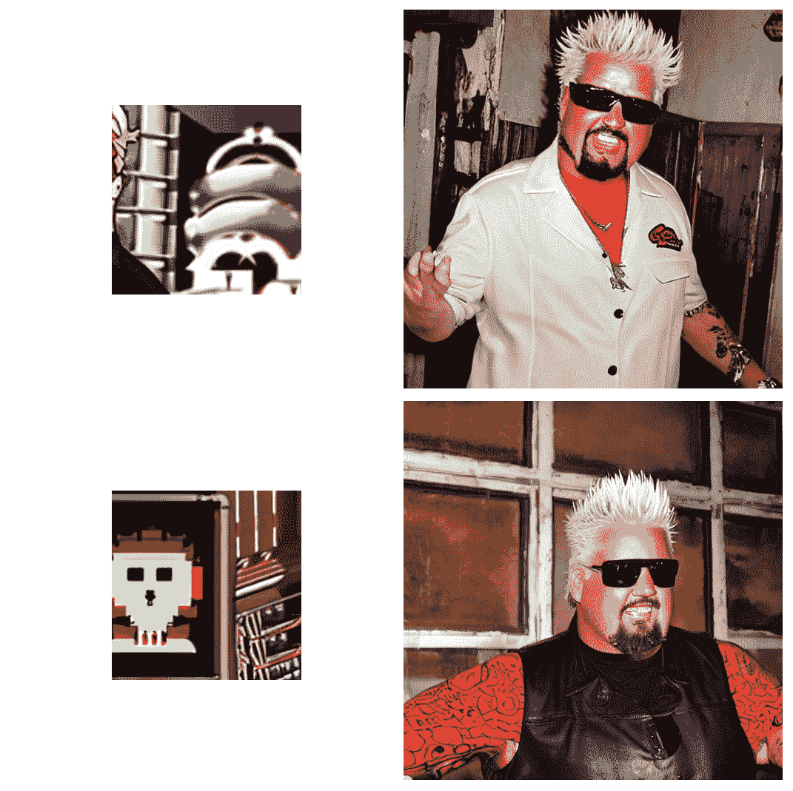

256x256 vs. 512x512 sample comparison for the prompt "Guy Fieri giving a tour of a haunted house"

#### 扩散步骤数

看起来扩散过程中的步数对超过大约 50 个时间步的某个阈值的结果影响不大。下面的图片是使用相同的随机种子和提示 ***【一辆红色跑车】*** 生成的。可以看出，更大数量的时间步长持续地提高了所生成图像的质量，但是过去 50 个时间步长的提高仅仅表现为对感兴趣对象的附带环境的微小改变。从 25 个时间步开始，赛车的细节实际上几乎完全一致，环境也在改善，在更大的时间步中变得更适合赛车。


[full resolution version](https://raw.githubusercontent.com/AssemblyAI-Examples/stable-diffusion-tutorial/main/comparison.png)

#### 图像纵横比

看起来图像质量和字幕相似性作为纵横比的函数取决于输入字幕。下面的图片面积相同但长宽比不同，都是使用标题 ***“一座钢和玻璃的现代建筑”*** 生成的。结果是相对统一的，虽然垂直图像似乎是最好的，其次是正方形，然后是水平。鉴于这种类型的现代建筑又高又瘦，这并不奇怪。因此，作为长宽比函数的性能似乎取决于主体。


不幸的是，稳定扩散受限于可因子分解的长宽比，使得更精细的实验不可能，但无论如何正方形图像应该满足大多数目的。

### 检查点符号链接

为了避免每次生成图像时都必须向检查点提供`--ckpt sd-v1-4.ckpt`，您可以在检查点和默认值`--ckpt`之间创建一个符号链接。在终端中，导航到`stable-diffusion`目录并执行以下命令:

```py
mkdir -p models/ldm/stable-diffusion-v1/
ln -s sd-v1-4.ckpt models/ldm/stable-diffusion-v1/model.ckpt 
```

或者，您可以简单地将检查点移动到默认的`--ckpt`位置:

```py
mv sd-v1-4.ckpt models/ldm/stable-diffusion-v1/model.ckpt
```

### 我真的把瑞克卷进去了吗？

是的。如果稳定扩散检测到生成的图像可能违反其[安全过滤器](https://stability.ai/blog/stable-diffusion-public-release)，则生成的图像将被替换为里克·阿斯特利的静止图像。


## 最后的话

这就是使用新的稳定扩散模型生成图像所需要的一切-不要忘记在 [Twitter](https://twitter.com/AssemblyAI) 上与我们分享您有趣的创作！如果你想了解更多关于稳定扩散是如何工作的，你可以查看我们的[机器学习扩散模型介绍](https://www.assemblyai.com/blog/diffusion-models-for-machine-learning-introduction/)文章。如果你喜欢这篇文章，请随时查看我们的[博客](https://www.assemblyai.com/blog/)或 [YouTube](https://www.youtube.com/c/AssemblyAI) 频道的机器学习内容，或者随时关注我们的时事通讯，了解新发布的内容。

喜欢这篇文章吗？

关注我们的时事通讯，了解更多类似的内容！

[Follow](https://assemblyai.us17.list-manage.com/subscribe?u=cb9db7b18b274c2d402a56c5f&id=2116bf7c68)

我们使用稳定扩散生成的一些图像:

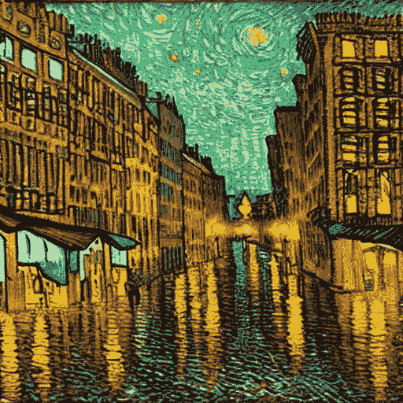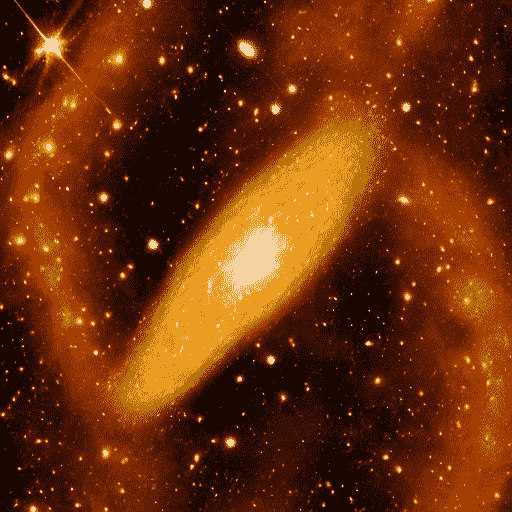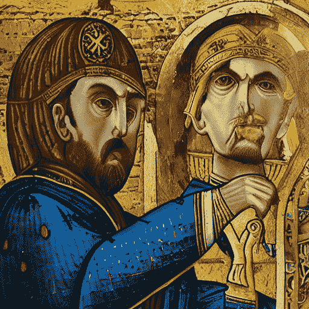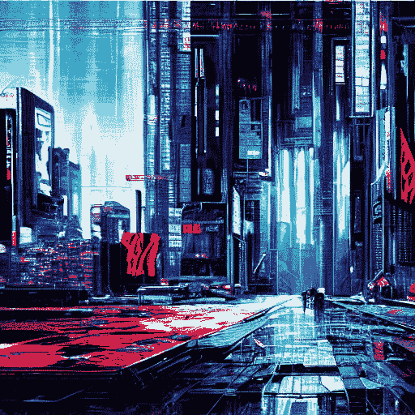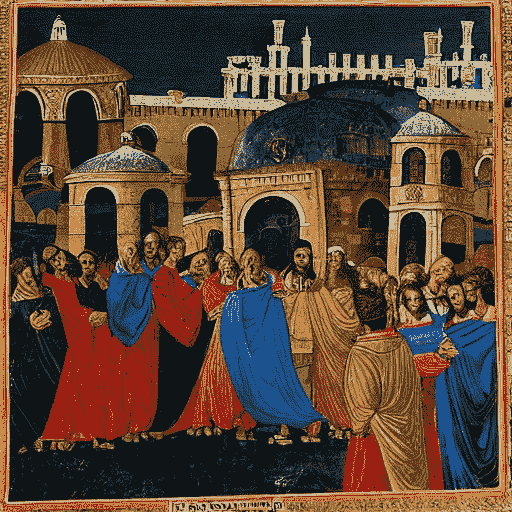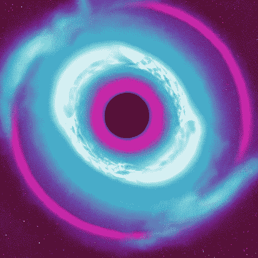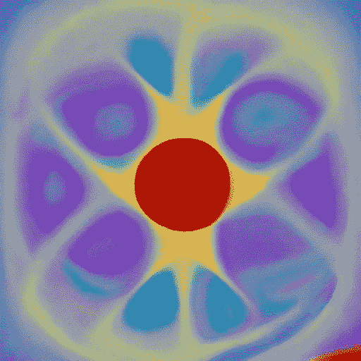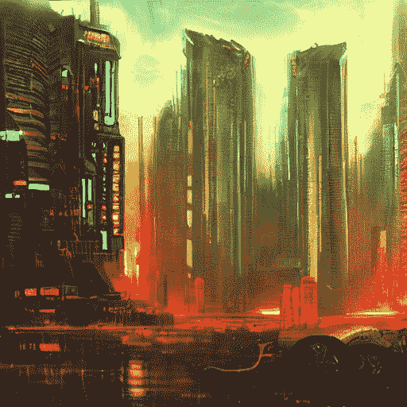