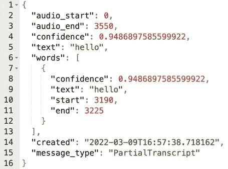

# 使用 Python 中的语音识别功能自动发布您的文字

> 原文：<https://www.assemblyai.com/blog/auto-tweet-your-words-using-speech-recognition-in-python/>

没人听的时候，我们说最有趣的事情。但是如果有人一直这样做呢？在这篇文章中，我们将学习如何制作一个应用程序，它会听你说话，并大声说出你说的最有趣、最聪明或最相关的事情。

该应用程序将通过听你说话并记录你的句子来工作。在你说了一些你想发推特的话后，你可以说关键词“推特”，它会在推特上发布你的最新句子。

我们将使用 Python 制作应用程序。主要的图书馆有:

*   **PyAudio** 用于收听输入源
*   为了方便使用 Twitter API，Twython
*   **汇编 AI** 用于语音到文本的转录

## 设置依赖项

在编码之前，我们需要 Twitter 和 AssemblyAI 凭证。获取 AssemblyAI API 令牌非常简单。只需[注册 AssemblyAI](https://assemblyai.com) 并登录即可找到您的令牌。如果你以前从未使用过 AssemblyAI，你可以获得一个免费的 API 令牌。

[Get your Free API token](https://assemblyai.com)

为了使用 Twitter API，请访问 [Twitter 开发者门户](https://developer.twitter.com/)并创建一个帐户。在向 Twitter 提供一些信息之后，您需要创建一个项目并获得必要的凭证。对于此项目，您需要读写权限。

这个项目中有两个文件。主 Python 脚本和一个配置文件。用来自 AssemblyAI 的认证密钥和来自 Twitter 的其他凭证填充您的配置文件，如下所示:

```
auth_key = ''
consumer_key        = ''
consumer_secret     = ''
access_token        = ''
access_token_secret = ''
```

在主脚本中，我们从导入我们需要的所有库开始。

```
import websockets
import asyncio
import base64
import json
import pyaudio
from twython import Twython
from configure import *
```

## 用麦克风听

接下来是设置 PyAudio 的参数并启动一个流。

```
FRAMES_PER_BUFFER = 3200
FORMAT = pyaudio.paInt16
CHANNELS = 1
RATE = 16000
p = pyaudio.PyAudio()

# starts recording
stream = p.open(
  format=FORMAT,
  channels=CHANNELS,
  rate=RATE,
  input=True,
  frames_per_buffer=FRAMES_PER_BUFFER
)
```

这里需要注意的要点是`RATE`参数。当设置到 AssemblyAI 终结点的连接时，需要指定相同的采样率。由于在这个项目中，句子将被实时转录，我们将使用 AssemblyAI 的实时端点。

```
URL = "wss://api.assemblyai.com/v2/realtime/ws?sample_rate=16000"
```

## 连接到 Twitter

如上所述，我们使用 Twython 来建立到 Twitter API 的连接。为此，只需要 configure.py 文件中的凭证。

```
twitter = Twython(
  consumer_key,
  consumer_secret,
  access_token,
  access_token_secret
)
```

构建 auto-tweeter 应用程序的下一步是设置不断聆听和转录句子的异步行为。为此，将使用 Python 的 asyncio 库。

## 向 AssemblyAI 发送音频

我们有一个听和抄写的功能。监听功能将被称为`send` ***。*** 它的主要目标是捕捉音频，并发送给 AssemblyAI 的语音转文本 API。转录功能将被称为`receive`，其主要目标是不断监听 AssemblyAI 的端点以获得转录的音频结果。

我们先来看看听音功能。该函数将无限期运行，将对麦克风所说的任何内容发送给 AssemblyAI。因此出现了`while True`线。该函数的实际功能被封装在`try`和`except`块中，以捕捉任何潜在的错误。`try`块中的四行执行该功能的主要功能。

```
async def send():
  while True:
    try:
      data = stream.read(FRAMES_PER_BUFFER)
      data = base64.b64encode(data).decode("utf-8")
      json_data = json.dumps({"audio_data":str(data)})
      r = await _ws.send(json_data)

    except websockets.exceptions.ConnectionClosedError as e:
      print(e)
      assert e.code == 4008

    except Exception as e:
      print(e)
      assert False, "Not a websocket 4008 error"

    r = await asyncio.sleep(0.01)
```

函数做的很简单。在捕获音频后，该函数将其编码为必要的格式，并发送给 AssemblyAI。

## 解读转录

另一方面,`Receive`函数，顾名思义，从 AssemblyAI 接收结果。

```
async def receive():
  while True:
    try:
      result_str = await _ws.recv()
      result = json.loads(result_str)['text']

      if json.loads(result_str)['message_type']=='FinalTranscript':
        print(result)
        if result == 'Tweet.' and previous_result!='':
          twitter.update_status(status=previous_result)
          print("Tweeted: %s" % previous_result)
        previous_result = result

    except websockets.exceptions.ConnectionClosedError as e:
      print(e)
      assert e.code == 4008

    except Exception as e:
      print(e)
      assert False, "Not a websocket 4008 err
```

让我们一步一步来，破译这一组代码。`"result_str"`变量有来自 AssemblyAI 的响应。它看起来是这样的:



该响应具有关于该转录的完整信息，包括音频开始和结束时间戳、转录的置信度和结果文本。非常有帮助的一个关键属性是在响应结束时一直使用`"message_type"`。

就目前的情况来看，AssemblyAI 将发送回未完成的句子或`"PartialTranscripts"`,因为我们使用的是实时端点。AssemblyAI 确认句子结束后，它会添加正确的标点符号，并在必要的地方大写字母来完成句子。我们只想在 Twitter 上发布完整的句子，而不是部分文字记录。这就是为什么使用以下代码行过滤响应的原因:

```
if json.loads(result_str)['message_type']=='FinalTranscript':
```

## 在推特上发布转录的句子

其余的行处理句子的推文。通过将前一个时间步长赋值给`"previous_result"`变量，可以记住该时间步长的转录。每当当前时间步长的结果脚本为`"Tweet."`时，我们就发布最后一句话:

```
twitter.update_status(status=previous_result)
```

## 建立异步行为

这两个函数(`send`和`receive`)将被包装在另一个函数中，以便能够异步运行它们。

```
async def send_receive():

  print(f'Connecting to url ${URL}')

  async with websockets.connect(
    URL,
    extra_headers=(("Authorization", auth_key),),
    ping_interval=5,
    ping_timeout=20
  ) as _ws:

    r = await asyncio.sleep(0.1)
    print("Receiving SessionBegins ...")

    session_begins = await _ws.recv()
    print(session_begins)
    print("Sending messages ...")
    result = ''

    async def send():
      while True:
        ...

    async def receive():
      while True:
        ...

    send_result, receive_result = await asyncio.gather(send(), receive())
```

除了包装`send`和`receive`函数，这个函数还使用 websockets 连接 AssemblyAI。定义函数后，它调用`send`和`receive`函数同时运行。

当然，在定义了这个函数之后，我们需要在脚本的最后调用它。下面是这样做的代码行:

```
asyncio.run(send_receive())
```

你可以在 GitHub 上找到代码。

更喜欢看这个教程？点击此处查看视频:

[https://www.youtube.com/embed/UTRtdIq2xCs?feature=oembed](https://www.youtube.com/embed/UTRtdIq2xCs?feature=oembed)