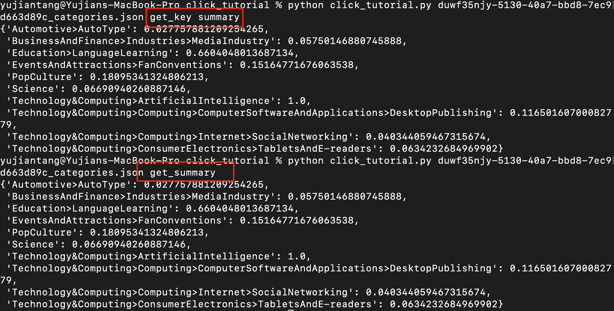
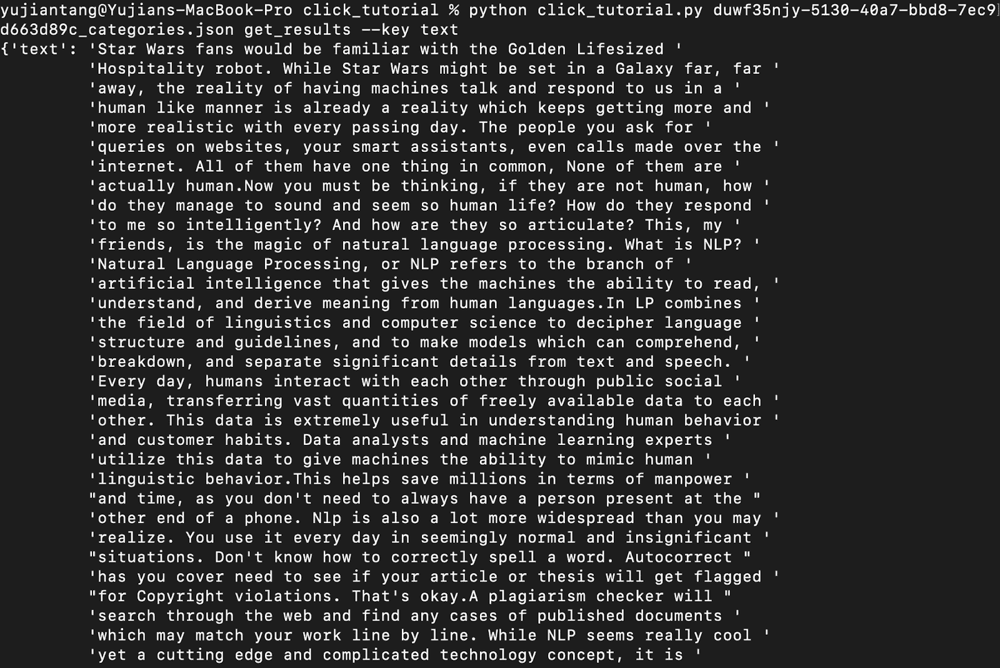
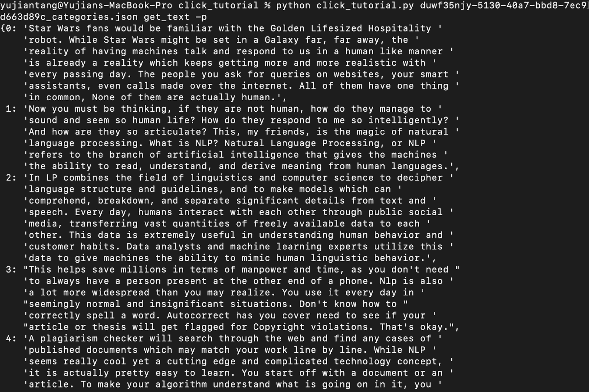
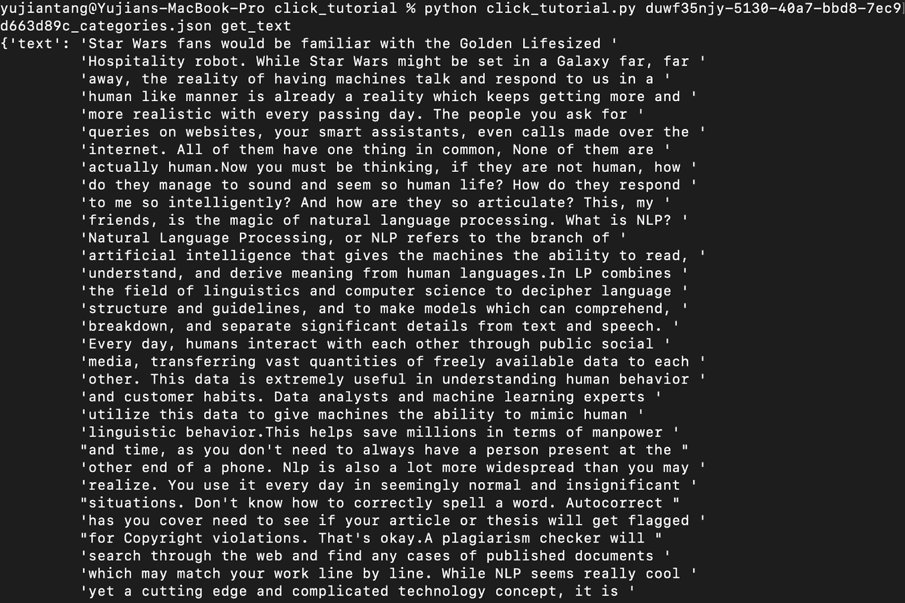
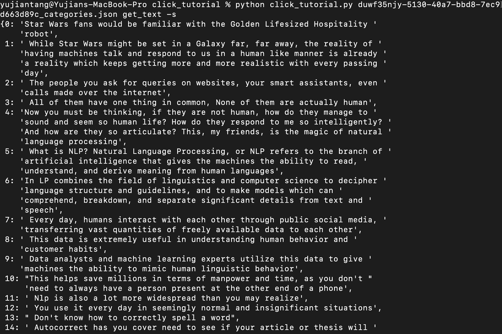
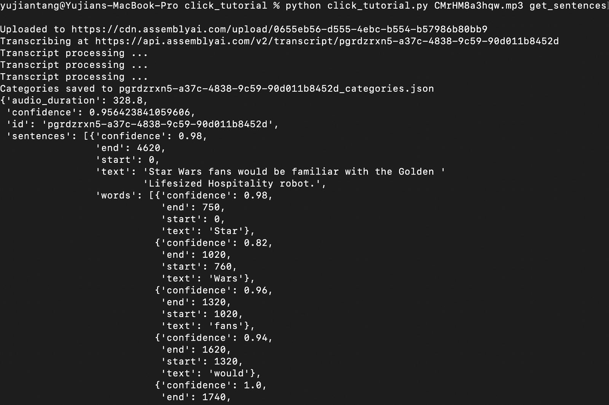

# Python 点击的权威指南

> 原文：<https://www.assemblyai.com/blog/the-definitive-guide-to-python-click/>

Python Click 能为你做什么？在本指南结束时，您将能够创建自己的命令行界面，该界面可以传递上下文，命令可以采用强制或可选参数，以及嵌套命令。这个示例 Python 项目将向您展示如何与不同的点击命令进行交互，从构建块(如`click.command`)到更高级的命令(如`click.make_pass_decorator`)。如果您有任何问题，请随时联系我[@于坚 _ 唐](https://twitter.com/yujian_tang?undefined)。你可以在这里找到源代码。

点击，或者“命令行界面创建工具包”是一个用于构建命令行界面的 Python 库。Python Click 的三个要点是命令的任意嵌套、自动帮助页面生成、支持运行时子命令的惰性加载。Click 提供了自己的合理化建议，说明为什么应该使用 Python Click 而不是其他 Python CLI 库。作为一名开发人员，我选择 Click 的理由是，它易于使用，并且提供了创建复杂命令行界面的必要功能。

让我们开始吧，我们要做的第一件事是创建一个*组*，在 click 中，一个组是一组(大概)相关的命令。我们要创建的这个组将基于与一个 [JSON 文档](https://github.com/ytang07/click-tutorial/blob/main/duwf35njy-5130-40a7-bbd8-7ec9d663d89c_categories.json?undefined)的交互，你可以从链接下载，或者跟随页面底部的教程，它将向你展示我是如何使用 [AssemblyAI](https://assemblyai.com) 生成它的，我们将把它作为一个字典加载。该组中的所有命令都将与我们加载的字典交互，因此我们将使用`pass_context`装饰器来保持字典存储在上下文中。上下文是保存命令执行的所有上下文的对象。在组命令中，上下文对象用于在命令之间传递信息。

```
import click
import json

'''
@click.group(<name>) creates a command that instantiates a group class
a group is intended to be a set of related commands
@click.argument(<argument name>) tells us that we will be passing an argument
and referring to that argument in the function by the name we pass it
@click.pass_context tells the group command that we're going to be using
the context, the context is not visible to the command unless we pass this

In our example we'll name our group "cli"
'''
@click.group("cli")
@click.pass_context
@click.argument("document")
def cli(ctx, document):
   """An example CLI for interfacing with a document"""
   _stream = open(document)
   _dict = json.load(_stream)
   _stream.close()
   ctx.obj = _dict

def main():
   cli(prog_name="cli")

if __name__ == '__main__':
   main()
```

在创建我们的组并在 main 中声明它后，我们应该有一个自动生成的`"--help"`选项，如下所示:


您的应该还没有列出所有的命令，但这只是我们将要构建的内容的一个大概。**注意**——所有命令必须在`main()`和我们的`click.group`装饰器之间定义。

现在我们已经在 Python Click 中创建了第一个组，让我们向它添加第一个命令。让我们创建一个命令来检查上下文，以确认我们有正确的类型。前面我们说过，我们希望将我们的对象作为字典加载到我们的上下文中，因此我们应该会得到如下结果:


要使这个命令成为我们之前创建的组的一部分，我们所要做的就是用装饰器`<group name>.command(<command name>)`装饰我们的函数。为了确保这个对象能够访问上下文，我们还使用了`pass_context`装饰器。

## 在 Python Click 中传递上下文

```
import pprint

'''
@click.command(<name>) creates a command that can be called with
the name that we pass through

Here we'll create an example command that prints out our context object,
which we expect to be a json looking dictionary
'''
@cli.command("check_context_object")
@click.pass_context
def check_context(ctx):
   pprint.pprint(type(ctx.obj))
```

现在我们对 decorator 和 Python Click 有了一些熟悉，让我们使用 Click 的功能来制作我们自己的 pass decorator。为什么我们要自己做？以便我们可以传递特定类型的对象(稍后我们还将演示如何使用`pass_obj`)。让我们制作一个 pass decorator 来专门传递一个 dictionary 对象，我们称之为`pass_dict`。

```
'''
Here we'll make a pass decorator, which we can use to pass
the last object stored of a type of our choosing in the context
by using click.make_pass_decorator(<type>)
'''
pass_dict = click.make_pass_decorator(dict)
```

‍Let's 发出一个命令，该命令将使用`pass_dict`装饰器来传递存储的字典对象。Python Click 库将搜索我们上面指定的类型(dict)的最里面的对象(在上下文中),并将它传递给我们的函数。当我们调用我们的`get_keys`函数时，它应该是这样的:


我们要做的就是使用`pass_dict`装饰器传递字典，然后提取键，并使用 Click 的`echo` *、* `style`、*、*和`secho`命令以不同的颜色打印出我们的键。

```
'''
click.echo is click's version of the echo command
click.style lets us style our output
click.secho is a command that takes a message, and a style command,
is a combination of click.echo and click.style

This command returns the keys to our dictionary object and
demonstrates how to use click.echo, click.style, and click.secho
'''
@cli.command("get_keys")
@pass_dict
def get_keys(_dict):
   keys = list(_dict.keys())
   click.secho("The keys in our dictionary are", fg="green")
   click.echo(click.style(keys, fg="blue"))
```

好了，现在我们知道了字典对象中有哪些键，让我们创建一个命令来获取我们传递的键的值。我们还将用`pass_context`来修饰它，因为我们将使用这个命令来演示任意点击命令嵌套的三个租户之一。我们将在`get_key`之后创建第二个命令，该命令将通过*调用*命令`get_key`来获取汇总键的值。

```
'''
This command gets a specific key from the context object
'''
@cli.command("get_key")
@click.argument("key")
@click.pass_context
def get_key(ctx, key):
   pprint.pprint(ctx.obj[key])

'''
click.invoke(<command>, <args>) is click's way of letting us
arbitrarily nest commands. NOTE: this command can only be used
when both the command being invoked AND the the command
doing the invoking use @click.pass_context

Since we already have a get_key command, we can just call that
to print out a summary
'''
@cli.command("get_summary")
@click.pass_context
def get_summary(ctx):
   ctx.invoke(get_key, key="summary")
```

两者应该产生相同的输出，如下所示:



想找更多这样的教程？

订阅我们的时事通讯！

[Subscribe Now](Subscribe to our newsletter!)

## 向命令行界面添加可选参数

现在让我们来看看如何使用`click.options`装饰器。当您想要向命令传递可选参数时，可以使用这个装饰器。它可以用来传递一个参数，或者作为一个标志传递。如果您希望您的选项作为一个标志被传递，那么在使用您的装饰器时将参数`is_flag`设置为 True。

```
'''
@click.option(<one dash usage>, <two dash usage>, is_flag (optional), help = <help>)
is how we can pass options to our command

We'll create a function that gets the "results" of our dictionary
and we will pass it two optional arguments, one to specify that
we want a specific key from the results, and a flag to indicate
whether or not we want to save our results to a json file
'''
@cli.command("get_results")
@click.option("-d", "--download", is_flag=True, help="Pass to download the result to a json file")
@click.option("-k", "--key", help="Pass a key to specify that key from the results")
@click.pass_context
def get_results(ctx, download: bool, key: str):
   results = ctx.obj['results']
   if key is not None:
       result = {}
       for entry in results:
           if key in entry:
               if key in result:
                   result[key] += entry[key]
               else:
                   result[key] = entry[key]
       results = result
   if download:
       if key is not None:
           filename = key+'.json'
       else:
           filename = "results.json"
       with open(filename, 'w') as w:
           w.write(json.dumps(results))
       print("File saved to", filename)
   else:
       pprint.pprint(results)
```

在我们的例子中，我们显示了字典的`"results"`键。您会注意到，我还传入了上面我们编写的`--key`选项，并选择获取结果的文本。



如果我还传入了`-d`或`--download`，命令会将文件下载到一个`.json`文档中，而不是在终端中显示。


好的，我想介绍的最后一个点击装饰器是`pass_obj`，它的行为就像我们根据之前制作 pass 装饰器的经验和之前使用 Python Click 的`pass_context`所期望的那样。我们还将对我们的文本做一些有趣的事情，我们可以用三种不同的格式获取我们的文本。作为一个大的文本块，我将把它设置为默认的，按句子，或按段落。

```
'''
@click.pass_obj is similar to @click.pass_context, instead
of passing the whole context, it only passes context.obj

We'll do something fun with our text extractor, we'll include
options to extract as either paragraphs or sentences, and
default to returning one big block of text
'''
@cli.command("get_text")
@click.option("-s", "--sentences", is_flag=True, help="Pass to return sentences")
@click.option("-p", "--paragraphs", is_flag=True, help="Pass to return paragraphs")
@click.option("-d", "--download", is_flag=True, help="Download as a json file")
@click.pass_obj
def get_text(_dict, sentences, paragraphs, download):
   """Returns the text as sentences, paragraphs, or one block by default"""
   results = _dict['results']
   text = {}
   for idx, entry in enumerate(results):
       if paragraphs:
           text[idx] = entry['text']
       else:
           if 'text' in text:
               text['text'] += entry['text']
           else:
               text['text'] = entry['text']
   if sentences:
       sentences = text['text'].split('.')
       for i in range(len(sentences)):
           if sentences[i] != '':
               text[i] = sentences[i]
       del text['text']
   pprint.pprint(text)
   if download:
       if paragraphs:
           filename = "paragraphs.json"
       elif sentences:
           filename = "sentences.json"
       else:
           filename = "text.json"
       with open(filename, 'w') as w:
           w.write(json.dumps(results))
       print("File saved to", filename)
```

响应应该是这样的:

句子:


段落:



没有可选参数:



好了，现在我将演示如何让两个不同的点击命令组从同一个文件中运行。我们要做的是允许用户传递一个 JSON 文件，或者任何. mp3 文件，该文件的结构与我们的[示例 JSON 文件](https://github.com/ytang07/click-tutorial/blob/main/duwf35njy-5130-40a7-bbd8-7ec9d663d89c_categories.json?undefined)相同。为了遵循本指南的其余部分，你需要一个来自 [AssemblyAI](https://assemblyai.com) 的 API 密匙。我们要做的是复习一下如何使用上面的文本选项，但是我们将直接从 AssemblyAI 中获取句子和段落。

为了举例说明运行两个 python click 命令组的情况，请跳到最后一个代码段。

我们要做的第一件事是声明一些全局变量和我们的导入。请注意，我正在从配置文件中导入我的身份验证密钥。建议您将 API 密钥存储在一个单独的文件中，以避免上传和暴露它们。我们将需要请求来发送请求，不时地休眠来自动轮询我们的端点，并需要来自 configure 的 auth key 来访问 AssemblyAI API。

```
import requests
from time import sleep
from configure import auth_key

transcript_endpoint = "https://api.assemblyai.com/v2/transcript"
upload_endpoint = 'https://api.assemblyai.com/v2/upload'
headers = {
   "authorization": auth_key,
   "content-type": "application/json"
}
CHUNK_SIZE = 5242880
```

让我们创建我们的第二组。我将把它命名为*“assembly”*，因为我们用它来与 AssemblyAI 的 API 交互。我将让创建组的函数也获取我们的 mp3 文件，上传并转录它，并将返回的`id`保存到上下文中。稍后，我们将使用 id 轻松地从 API 端点获取句子和段落。

```
@click.group("assembly")
@click.pass_context
@click.argument("location")
def assembly(ctx, location):
   """A CLI for interacting with AssemblyAI"""
   def read_file(location):
       with open(location, 'rb') as _file:
           while True:
               data = _file.read(CHUNK_SIZE)
               if not data:
                   break
               yield data

   upload_response = requests.post(
       upload_endpoint,
       headers=headers, data=read_file(location)
   )
   audio_url = upload_response.json()['upload_url']
   print('Uploaded to', audio_url)
   transcript_request = {
       'audio_url': audio_url,
       'iab_categories': 'True',
   }

   transcript_response = requests.post(transcript_endpoint, json=transcript_request, headers=headers)
   transcript_id = transcript_response.json()['id']
   polling_endpoint = transcript_endpoint + "/" + transcript_id
   print("Transcribing at", polling_endpoint)
   polling_response = requests.get(polling_endpoint, headers=headers)
   while polling_response.json()['status'] != 'completed':
       sleep(30)
       print("Transcript processing ...")
       try:
           polling_response = requests.get(polling_endpoint, headers=headers)
       except:
           print("Expected to wait 30 percent of the length of your video")
           print("After wait time is up, call poll with id", transcript_id)
           return transcript_id
   categories_filename = transcript_id + '_categories.json'
   with open(categories_filename, 'w') as f:
       f.write(json.dumps(polling_response.json()['iab_categories_result']))
   print('Categories saved to', categories_filename)
   ctx.obj = polling_response.json()['id']
```

‍Thanks 的 API 端点 AssemblyAI 的辉煌设计，我们可以得到几乎完全相同的段落或句子的功能。我们需要做的就是构造端点，然后发送一个 HTTP GET 请求。

```
@assembly.command("get_sentences")
@click.pass_context
def get_sentences(ctx):
   sentences_endpoint = transcript_endpoint + "/" + ctx.obj + "/sentences"
   sentences_response = requests.get(sentences_endpoint, headers=headers)
   pprint.pprint(sentences_response.json())

@assembly.command("get_paragraphs")
@click.pass_context
def get_paragraphs(ctx):
   paragraphs_endpoint = transcript_endpoint + "/" + ctx.obj + "/paragraphs"
   paragraphs_response = requests.get(paragraphs_endpoint, headers=headers)
   pprint.pprint(paragraphs_response.json())
```

好了，现在我们的汇编组中已经有了几个示例命令，让我们来看看如何实际上让两个命令组同时运行，并“智能地”(基于我们的输入)运行不同的组。我们要做的是转换我们的`main()`函数来检查我们的第一个参数是否包含 JSON 文件或. mp3 文件。

```
import sys

def main():
   if ".json" in sys.argv[1]:
       cli(prog_name="cli")
   if ".mp3" in sys.argv[1]:
       assembly(prog_name="assembly")
```

正如你从下面两张图片中看到的，我们新的命令行工具可以识别输入并正确运行命令。



现在，关于如何使用 Python Click 制作命令行界面的教程已经接近尾声。如果您对如何使用 Click 有任何疑问，请发微博给我[@于坚 _ 唐](http://twitter.com/yujian_tang?undefined)或通过 [LinkedIn](https://www.linkedin.com/in/yujiantang/?undefined) 联系我。有关如何使用 AssemblyAI API 的更多信息，请查看这篇在 25 行代码内进行 [Python 语音识别的教程](https://www.assemblyai.com/blog/python-speech-recognition-in-under-25-lines-of-code)或这篇关于构建 [YouTube 转录器的教程](https://www.assemblyai.com/blog/how-to-get-the-transcript-of-a-youtube-video)并关注我们 [@assemblyai](http://twitter.com/assemblyai?undefined)