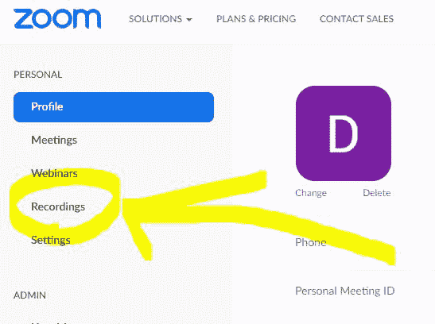
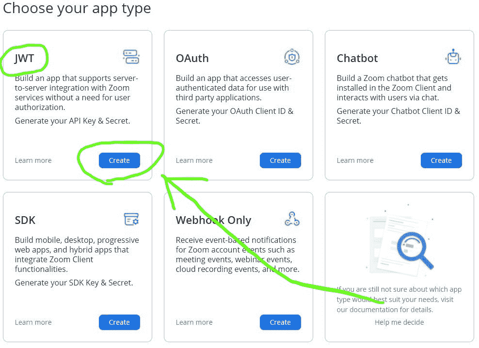
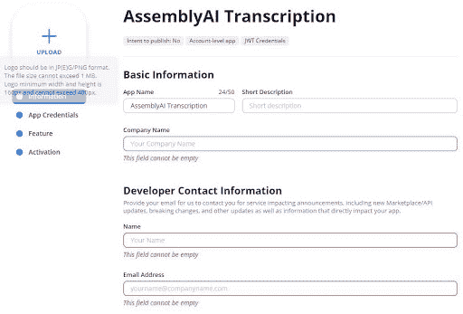
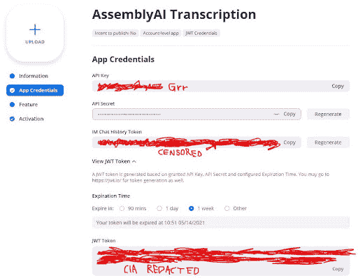
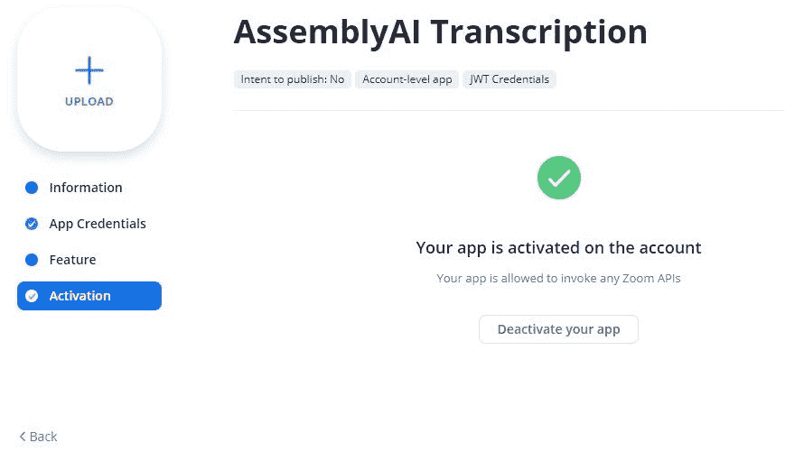
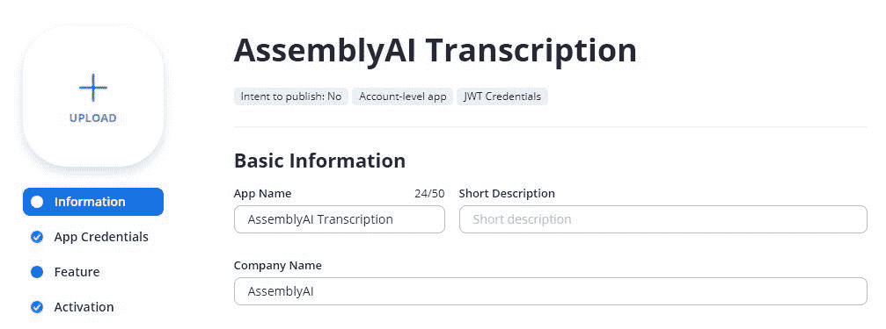
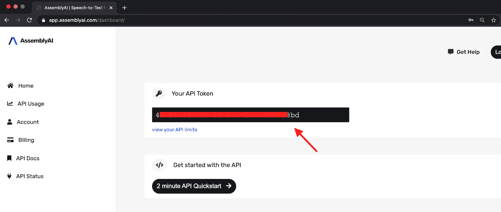

# 如何用 Zoom API 获得 Zoom 脚本

> 原文：<https://www.assemblyai.com/blog/zoom-transcription-zoom-api/>

在这篇文章中，我们将向您展示如何通过用 Python 连接 Zoom 的 API 和 AssemblyAI 的自动语音识别 API 来转录您的 Zoom 录音。更具体地说，我们将带您了解:

*   在缩放时创建云记录
*   使用您自己的帐户访问 Zoom 的 API
*   从 Zoom 的 API 获取云记录
*   将云记录提交给 AssemblyAI 进行快速自动转录

准备好你的编码手指，让我们开始吧！

## 在缩放时创建云记录

在 Zoom 中创建云录制首先要知道的是，你必须有一个 ****Pro，Business，或者企业账号**** 。基本免费缩放计划没有启用会议录制功能。你可能已经有这样的计划，可能已经有云录音准备转录，这种情况下，你可以跳到下一个头，继续滚动。

但是如果你刚刚为你的项目获得了一个升级的 Zoom 帐户，并且你仍然需要创建一个云记录，一些事情要记住。首先，您不需要让另一个人参加会议，云录制就可以工作。不需要和别人一起安排。

如果您使用的是台式机、笔记本电脑或大型平板电脑，则开始录制的按钮如下所示:


录制结束后，会有一个弹出框告诉你，一旦录制完成，你会收到一封电子邮件。Zoom 的帮助页面谨慎地警告用户，它可能需要 24-48 小时才能准备好，但这可能是 2020 年初的现实，当时全世界都涌向 Zoom，而他们的系统还没有准备好应对这种流量水平。较长的录音可能还需要一段时间，但我发现在 2021 年，它们几乎马上就准备好了。

要查找您的录像，请登录 Zoom，然后导航至 ****我的帐户**** 。


向左，点击**标签。**

****

**现在，应许之地！在那里你会看到你的云录音，为你准备好了 mp4 和 m4a 格式。**

****

## **访问您的缩放 API 密钥**

**现在，让我们一步一步地完成获取 Zoom 后门钥匙的过程。我想为 Billy Harmawan 向我展示了这个有点复杂的过程。这里我也给你讲一下它的要点。**

**首先，你需要在一个新标签中导航到 [Zoom 的应用市场](https://marketplace.zoom.us/?undefined)。您可能已经从您的主帐户页面登录，但如果没有，您可以使用相同的凭据登录，然后在登录后导航回 Zoom 应用程序市场。**

**二、点击右上角的 ****【开发】**** ，下拉菜单中的 ****【构建 App】****。**

****

**第三，你需要选择 ****【创建】********【JWT】****下的 app 类型。我们将使用 [JSON Web Tokens](https://en.wikipedia.org/wiki/JSON_Web_Token?undefined) ( [JWT 的](https://jwt.io/?undefined))用于这个转录连接，因为它们易于再生，在代码中使用，并且可以附加到 url。**

****

**第四，为你的 Zoom 应用取一个独特的名字。**

****

**第五，您需要填写它将带您进入的信息页面上的必填字段。**

****

**第六，在接下来的页面上，应该会生成您的 API 凭证！**

****

**从这里，创建一个 ****`tokens.env`**** 文本文件，并将每个凭证保存在一个变量名下，如下所示。你会需要这个。env 文件放在代码中。**

```
`ZOOM_API_KEY = USE_STEPS_ABOVE_TO_GET_YOUR_VERY_OWN_ZOOM_API_KEY
ZOOM_API_SECRET = USE_STEPS_ABOVE_TO_GET_YOUR_VERY_OWN_ZOOM_API_SECRET
ZOOM_IM_CHAT_HISTORY_TOKEN = USE_STEPS_ABOVE_TO_GET_YOUR_VERY_OWN_ZOOM_IM_CHAT_HISTORY_TOKEN
ZOOM_JWT = USE_STEPS_ABOVE_TO_GET_YOUR_VERY_OWN_ZOOM_JWT`
```

> **注意:在凭证页面上生成的第一个*JWT 令牌最好放在`dotenv`文件中以防万一，但是我们的代码将会生成新的 JWT 令牌。所以把它复制下来，但是要知道这可能是不必要的。***

**最后，您可以跳过此应用程序创建页面上可选的 ****“功能”**** 选项卡，直接进入 ****“激活”**** 以确认您已经完成。**

****

**接下来的几个步骤只是双重和三重检查，以确保应用程序存在于您的帐户中，并且如果您需要，可以在未来管理凭据。**

**导航回 [Zoom 的应用市场](https://marketplace.zoom.us/?undefined)，点击右上角的**“管理”**按钮。**

****

**你会看到你的应用程序列表。**

****

**单击应用程序的名称，当您再次看到此屏幕时...**

****

**...你可以放心，因为你知道 Zoom 的 API 已经为你准备好了。**

## **注册一个汇编 api 令牌**

**只需输入你的电子邮件地址，你就可以在几秒钟内注册一个免费的 AssemblyAI 账户。从您的电子邮件地址验证您的帐户后，您将直接返回到您的新帐户，您可以在您的仪表板中看到您的 API 令牌。**

****

**获取 API 令牌并将其添加到您的`tokens.env`文件中，就像您为 Zoom 的 API 密钥所做的一样，并使用它自己唯一的变量名。**

```
`ZOOM_API_KEY = USE_STEPS_ABOVE_TO_GET_YOUR_VERY_OWN_ZOOM_API_KEY

ZOOM_API_SECRET = USE_STEPS_ABOVE_TO_GET_YOUR_VERY_OWN_ZOOM_API_SECRET

ZOOM_IM_CHAT_HISTORY_TOKEN = USE_STEPS_ABOVE_TO_GET_YOUR_VERY_OWN_ZOOM_IM_CHAT_HISTORY_TOKEN

ZOOM_JWT = USE_STEPS_ABOVE_TO_GET_YOUR_VERY_OWN_ZOOM_JWT

ASSEMBLYAI_TOKEN = SIGN_UP_AT_ASSEMBLYAI_TO_GET_YOUR_VERY_OWN_ASSEMBLYAI_TOKEN`
```

## **用 Python 从 Zoom 的 API 获取云记录**

**旋转一个`zoom.py`文件，将这些导入语句放在顶部:**

```
`import sys
import time
import requests
import authlib
import os
import urllib.request
from dotenv import load_dotenv
from pathlib import Path
from typing import Optional, Dict, Union, Any
from authlib.jose import jwt
from requests import Response
import http.client
import json`
```

**现在找到您的`tokens.env`文件的目录路径，或者将`tokens.env`文件移动到您的`zoom.py`所在的目录，然后将这段代码添加到您的`zoom.py`脚本中:**

```
`env_path = Path('.')/'tokens.env'
load_dotenv(dotenv_path=env_path)`
```

**接下来，您将通过给一些变量命名来从`tokens.env`文件中获取凭证。您将在后续代码中使用的变量位于“=”的左侧，您在 tokens.env 文件中用于该 API 凭证的别名变量将是“=”分配器右侧的字符串。**

```
`API_KEY= os.getenv("ZOOM_API_KEY")
API_SECRET= os.getenv("ZOOM_API_SECRET")
ASSEMBLY_AI_TOKEN = os.getenv("ASSEMBLYAI_TOKEN")`
```

**现在，您将创建一个 Zoom 类，该类将生成实时 JWT，您将需要该类来解锁其余代码中的云记录。再次，大声喊出来[比利·哈曼](https://medium.com/swlh/how-i-automate-my-church-organisations-zoom-meeting-attendance-reporting-with-python-419dfe7da58c?undefined)设计了这个。**

```
`class Zoom:
    def __init__(self, api_key: str, api_secret: str):
        self.api_key = api_key
        self.api_secret = api_secret
        self.jwt_token_exp = 518400
        self.jwt_token_algo = "HS256"

    def generate_jwt_token(self) -> bytes:
        iat = int(time.time())

        jwt_payload: Dict[str, Any] = {
            "aud": None,
            "iss": self.api_key,
            "exp": iat + self.jwt_token_exp,
            "iat": iat
        }

        header: Dict[str, str] = {"alg": self.jwt_token_algo}

        jwt_token: bytes = jwt.encode(header, jwt_payload, self.api_secret)

        return jwt_token`
```

**然后，您将创建一个 Zoom 类的实例，并使用它来生成一个实时 JWT。**

```
`zoom = Zoom(API_KEY, API_SECRET)
jwt_token: bytes = zoom.generate_jwt_token()
jwt_token_str = jwt_token.decode('UTF-8')
print(jwt_token_str)`
```

**使用下面的代码，它直接来自 Zoom 的 [API 文档](https://marketplace.zoom.us/docs/api-reference/zoom-api/users/users?undefined)，来获得你的`USER_ID`。**

**如果您与多个用户使用一个共享帐户，您可能需要登录您的 zoom 帐户，然后导航至 ****【我的帐户】**** ，以明确哪些用户拥有您想要录制的云录像。下面的代码使用`["users"][0]`(返回的第一个用户)作为示例，但是您可能需要根据哪个用户拥有您需要访问的云记录来调整索引号。**

```
`conn = http.client.HTTPSConnection("api.zoom.us")

headers = { 'authorization': 'Bearer ' + jwt_token_str}

conn.request("GET", "/v2/users?page_size=30&status=active", headers=headers)

res = conn.getresponse()
data = res.read()
user_dict = json.loads(data.decode("utf-8"))
USER_ID = user_dict['users'][0]['id']

print(USER_ID)`
```

**对于下一步，您可能需要在 url 请求中指定日期范围， [Zoom API 文档](https://marketplace.zoom.us/docs/api-reference/zoom-api/cloud-recording/recordingslist?undefined)中的自动生成向您展示了如何做。默认情况下，只返回最后一天的会议记录，因此，如果您想要录制的会议记录发生在那之前，您必须指定 per 格式。**

**‍From 在这里，你可以用下面的代码找到你想要访问的云录音的`MEETING_ID`。注意:`meeting_dict['meetings']`访问会议列表，但是我们将只使用第一个会议`meeting_dict['meetings'][0]`作为例子。**

```
`conn = http.client.HTTPSConnection("api.zoom.us")

conn.request(
    'GET', '/v2/users/' + USER_ID +
    '/recordings?trash_type=meeting_recordings&mc=false&page_size=30',
    headers=headers
    )

res = conn.getresponse()
data = res.read()
meeting_dict = json.loads(data.decode("utf-8"))
MEETING_ID = str(meeting_dict['meetings'][0]['id'])

print(MEETING_ID)`
```

**要获得`download_url`，添加下面的代码。**

```
`conn.request(
    "GET", '/v2/meetings/' + MEETING_ID + '/recordings', headers=headers
    )

res = conn.getresponse()
data = res.read()

response_obj = (data.decode("utf-8"))

print(response_obj)`
```

**之后，您现在可以将`download_url`据为己有了！**

```
`meeting_dict = json.loads(response_obj)
download_url = meeting_dict['recording_files'][0]['download_url']
print(download_url)`
```

**最后一次感谢 TriBloom 和 Caleb Spraul 帮助我找到了下一行代码，它让你的下载 URL 可以被 Zoom 和 AssemblyAI API 相互理解...**

```
`authorized_url = download_url + "?access_token=" + jwt_token_str`
```

## **将音频文件提交给 assembleia 进行转录**

**下面的代码使用`authorized_url`变量将缩放云记录 mp4 直接输入 AssemblyAI 的语音识别 API。**

```
`endpoint = 'https://api.assemblyai.com/v2/transcript'

json = {
    'audio_url': authorized_url
}

heads = {
    'authorization': ASSEMBLY_AI_TOKEN,
    'content-type': 'application/json'
}

resp = requests.post(endpoint, json=json, headers=heads)
print(resp.json())`
```

**成功的响应应该是这样的，显示`"status": "queued"‍`。**

```
`{
    # keep track of the id for later
    "id": "5551722-f677-48a6-9287-39c0aafd9ac1",
    # note that the status is currently "queued"
    "status": "queued",    
    "acoustic_model": "assemblyai_default",
    "audio_duration": null,
    "audio_url": "some/obscenely/long/zoom/api/url/",
    "confidence": null,
    "dual_channel": null,
    "format_text": true,
    "language_model": "assemblyai_default",
    "punctuate": true,
    "text": null,
    "utterances": null,
    "webhook_status_code": null,
    "webhook_url": null,
    "words": null
}`
```

## **获得您一直渴望的转录！**

**下面的代码将检查转录的状态，并为您将转录 id `resp.json()['id']`连接到 url，因此它将与前面的代码顺序运行。**

```
`status_point = 'https://api.assemblyai.com/v2/transcript/' + resp.json()['id']

status_header = {'authorization':ASSEMBLY_AI_TOKEN} 

status_check = requests.get(status_point, headers=status_header)

print(status_check.json())`
```

**音频文件需要大约 25%的音频时间来完成，因此 10 分钟的音频文件将在 2.5 分钟内完成。您将希望循环运行上面的代码，直到`status`键显示`"completed"`为止。**

```
`import time

while status_check.json()['status'] in ['queued', 'processing']:
  status_check = requests.get(status_point, headers=status_header)
  time.sleep(5)
  continue

print(status_check.json()['status'])
print('\n', status_check.json()['text'])
print('\n', status_check.json())`
```

**一旦`status`为`"completed"`，第二个打印语句`print(status_check.json()['text'])`将打印出实际的转录文本。第三个 print 语句打印出整个 API 响应，其中包含大量元数据，比如每个单词的发音时间、每个单词的置信度等等！你可以在的 [AssemblyAI 文档上看到 API 响应 JSON 的完整示例。](https://docs.assemblyai.com/overview/getting-started#result)**

**现在你知道如何转录变焦记录！ ****‍******