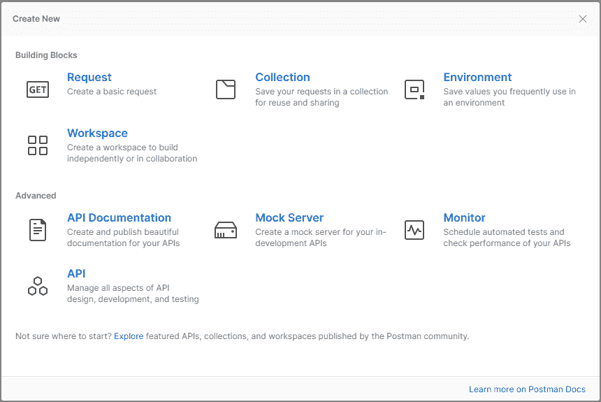
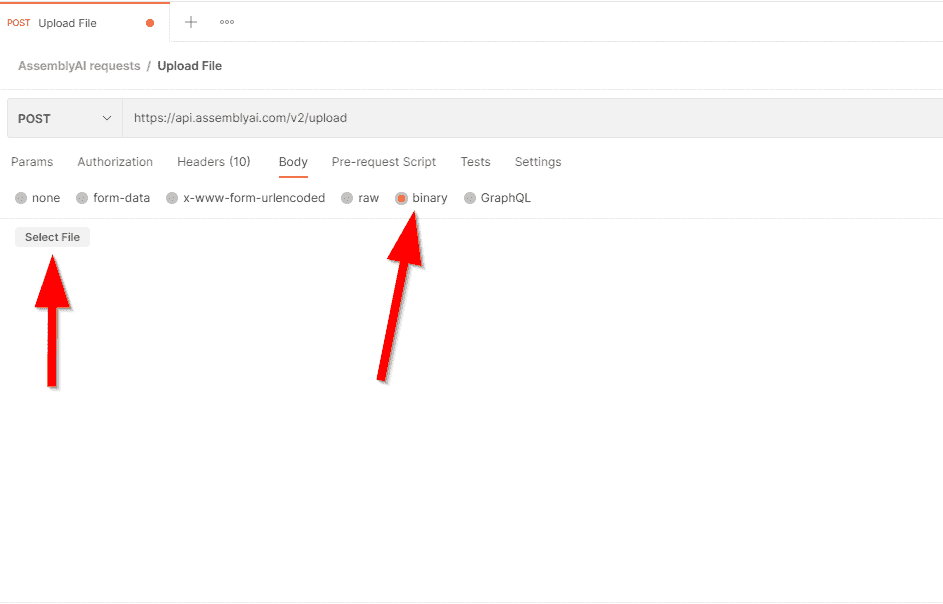

# 邮递员和程序集的语音到文本

> 原文：<https://www.assemblyai.com/blog/speedy-code-free-speech-to-text-with-assemblyai-and-postman/>

有时候我们就是没时间写代码；我们只想看到结果！

使用 [Postman](https://www.postman.com/?undefined) 和 AssemblyAI，我们可以获得语音到文本的转录，无需编写一行代码就可以完成令人敬畏的功能。

Postman 是一个用于 API 测试和开发的多功能应用程序。它提供了一个免费层，我们将在这篇博客中使用。

## 要求

*   一个免费的 [AssemblyAI 账户](https://app.assemblyai.com/login/?undefined)
*   [邮差](https://www.postman.com/downloads/?undefined)安装在你的电脑上

## 将本地文件上传到程序集

如果音频文件已经可以通过 URL 公开访问，您可以跳过这一部分，转到章节**“转录音频文件”**。

‍ 我们需要使用 API 上传一个本地音频文件到 AssemblyAI。作为响应，我们将收到一个指向上传的音频文件的 URL，只有 AssemblyAI 可以访问它。请注意，音频文件将在转录后立即删除。

打开 Postman 并**创建一个新的请求**，您可能需要先创建一个**“工作区”**。



‍Name 你的请求**【上传文件】**，或者类似的。您可以选择将它添加到一个[“集合”](https://learning.postman.com/docs/sending-requests/intro-to-collections/?undefined)，它是一组请求，或者如果需要的话创建一个新的集合。按“保存”完成该过程。‍


“‍A 新请求”选项卡现在应该已打开。

如下定义 HTTP 请求:

*   方法:`POST`
*   网址:`https://api.assemblyai.com/v2/upload`
*   标题:`Authorization: ASSEMBLY_AI_API_KEY`

你可以在这里找到你的 AssemblyAI API 密匙。


既然我们已经设置了标题，最后一步就是附加你想要上传的音频文件。

导航至**“Body”**选项卡。选择**“二进制”**作为类型，然后使用文件选择器从您的计算机中选择音频文件。‍



‍The 的请求现在已经准备发送了！按下邮递员右上角的蓝色**“发送”**按钮。几分钟后，您将收到如下所示的 JSON 响应:

```
{
    "upload_url": "https://cdn.assemblyai.com/upload/UNIQUE_ID_OF_UPLOAD"
}
```

### 转录音频文件

下一步是向 AssemblyAI 请求转录。让我们在 Postman 中创建新请求，将其命名为**“Transcription”**。

如下定义 HTTP 请求:

*   方法:`POST`
*   网址:`https://api.assemblyai.com/v2/transcript`
*   标题:
    -`Authorization: ASSEMBLY_AI_API_KEY`-
    -`Content-Type: application/json`


然后在“正文”选项卡中:

*   正文:`Raw`
*   内容类型:`JSON`(从下拉菜单中)

接下来，我们需要设置请求体。您可以使用我们之前发出的文件上传请求返回的 URL，也可以使用任何公开的音频文件 URL。

JSON 主体请求的基本格式应该如下所示:

```
{
    "audio_url": “AUDIO_FILE_URL”
}
```

‍If 您希望打开或关闭 API 提供的任何优秀特性，比如 [PII 修订](https://docs.assemblyai.com/all-guides/redact-pii-from-transcriptions?undefined)、[二进制化](https://docs.assemblyai.com/guides/getting-speaker-labels-speaker-diarization?undefined)、[替代声学模型](https://docs.assemblyai.com/overview/custom-models?undefined)等等，那么您可以在这个 JSON 请求体中这样做。

例如:

```
{
    "audio_url": “AUDIO_FILE_URL”,
    "speaker_labels": true
}
```

有关可用参数的完整列表，请参考[装配文档](https://docs.assemblyai.com/api-ref/v2-transcript?undefined)。

您的转录请求现在可以发送了。您可以再次点击蓝色的**“发送”**按钮，等待响应。‍


响应应该如下所示，根据请求中设置的任何参数而变化:

```
{
    "acoustic_model": "assemblyai_default",
    "audio_duration": null,
    "audio_url": "AUDIO_FILE_URL",
    "confidence": null,
    "dual_channel": null,
    "format_text": true,
    "id": "TRANSCRIPTION_ID",
    "language_model": "assemblyai_default",
    "punctuate": true,
    "status": "queued",
    "text": null,
    "utterances": null,
    "webhook_status_code": null,
    "webhook_url": null,
    "words": null
}
```

这里对我们来说重要的是`"id"`值。我们将需要这个值来检索我们的转录。

## 从汇编中检索转录

获取转录的最后一步是使用前一个请求返回的转录 ID 向 AssemblyAI 发出 GET 请求。

在 Postman 中创建一个新请求，将其命名为类似于**“下载转录”**。

创建第三个 HTTP 请求，如下所示:

*   方法:`GET`
*   网址:`https://api.assemblyai.com/v2/transcript/TRANSCRIPTION_ID`
*   标题:
    -`Authorization: ASSEMBLY_AI_API_KEY`-
    -`Content-Type: application/json`

注意，我们需要将`"id"`作为一个参数包含在 URL 的末尾。


因为这是一个 GET 请求，所以我们没有给请求添加一个`"Body"`。

最后按下蓝色**“发送”**按钮，等待响应。

如果 AssemblyAI 仍在处理音频文件，JSON 响应将把`"processing"`作为状态，除非有错误——参见[文档](https://docs.assemblyai.com/api-ref/v2-transcript?undefined)中状态代码的完整列表。

如果转录准备好了，则响应将包含转录文本以及每个单词的确定性和所请求的任何其他数据。

## 摘要

通过使用 Postman，我们很快就创建了一种无需编写任何代码就能获得转录的方法。这是试用 AssemblyAI 提供的服务的一种非常棒和方便的方式。它还可以用来快速获得一个副本。

根据您所选择的 Postman 许可等级，您还可以选择在您的团队中共享您的 API 集合。

快乐抄录！